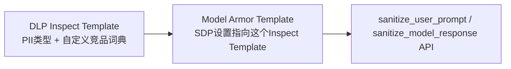
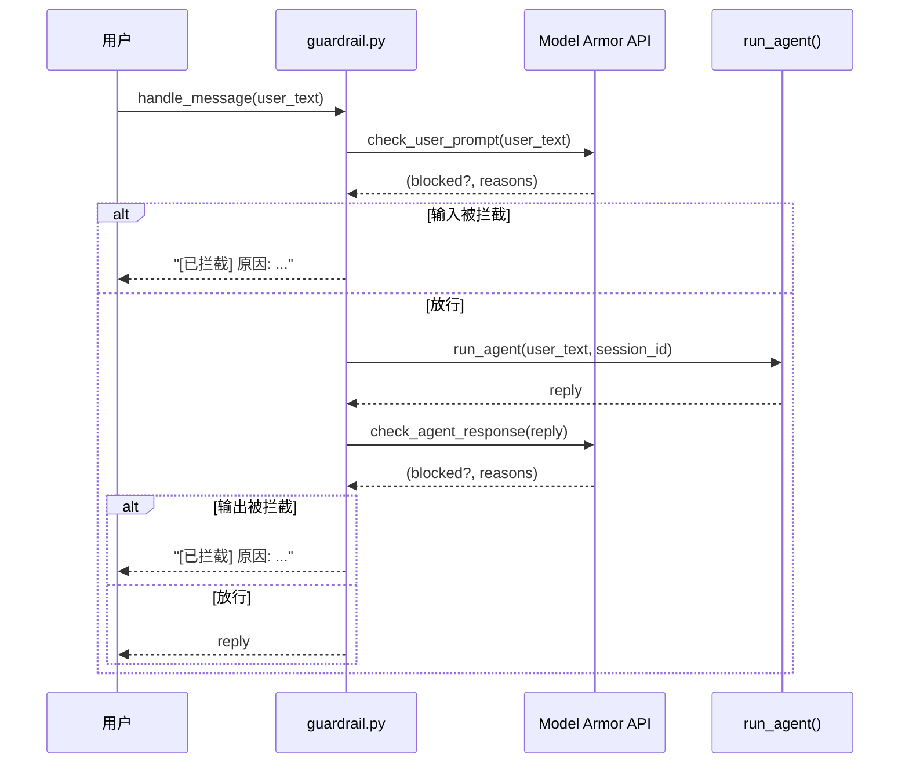

# 第 4 章 · Model Armor 护栏

## 4.1 这一步要解决什么问题

客户提了两条硬性要求:**不能泄露用户隐私信息(PII)**,**不能讨论竞品**。这一章要在 agent 的输入和输出两端都加上过滤,任一命中就拦截,而不是依赖 system prompt 里"请不要讨论竞品"这种软性约束(模型不一定会听)。

这里有两层含义值得展开:

**第一,为什么"两端"都要挡,而不是只挡输入。** 用户主动输入竞品名称当然要拦(比如"你们和 RivalMart 比哪个便宜"),但更隐蔽的风险来自模型自己的输出——比如 agent 在检索知识库、总结历史记录、或者被诱导之后,自己在回答里带出了用户的手机号(从工单记录里读到的),或者在对比分析时主动提到了竞品名称。**这不是用户的错,而是模型的行为不可预测**,所以护栏必须挂在输出端再检查一遍,形成"输入过滤 + 输出过滤"的双保险。

**第二,为什么不能只靠 system prompt。** 我们在最开始的方案里确实在 system prompt 里加了"不要讨论竞品、不要透露用户隐私信息"这类指令,但压测下来发现:多轮对话稍微绕一下弯(比如让 agent 做角色扮演、或者用间接提问的方式套话),模型还是有一定概率把话说出来。System prompt 本质上是"建议",不是"强制执行的规则"——它会被上下文长度稀释,会被更强的用户指令覆盖,也没有办法给出一个可审计的拦截记录。客户要的是一条**能力上限被框死、出了问题能查日志说清楚"为什么拦了"**的护栏,这必须是模型外部的、确定性的检查逻辑,而不是模型内部的自觉性。

!!! note "这一章和上一章的关系"
    第 3 章讲的是给 agent 本身的能力做限权(工具调用范围、数据访问边界),这一章讲的是给 agent 的"嘴"上锁——不管 agent 内部逻辑多复杂、调用了多少工具,最终吐给用户的文字和收到的用户输入,都要过一遍统一的护栏检查。两者是正交的两道防线。

## 4.2 在 GCP 上具体怎么做

### 架构:两个组件配合

Model Armor **没有单独的"自定义关键词过滤"功能**,它的护栏能力建立在 **Sensitive Data Protection(即 DLP)** 之上:



逐个箭头解读一下这张图里到底发生了什么调用关系:

- **A → B(DLP Inspect Template 被 Model Armor Template 引用)**:这一步不是运行时调用,而是**配置时的引用关系**。创建 Model Armor Template 时,我们把 DLP Inspect Template 的完整资源名(`projects/.../locations/.../inspectTemplates/agent-pii-and-competitor-block`)填进 Model Armor Template 的"高级 SDP 配置"字段里。Model Armor 侧不会拷贝一份 DLP 的规则,而是每次运行时都实时读取这个 Inspect Template 的当前定义——这意味着**以后调整竞品词典或 PII 类型,只需要更新 DLP Inspect Template,不需要重建 Model Armor Template**。
- **B → C(Model Armor Template 被 sanitize API 引用)**:这一步才是**真正的运行时调用**。业务代码不会直接跟 DLP 打交道,而是调用 Model Armor 的 `sanitize_user_prompt` / `sanitize_model_response` 这两个 REST API,请求体里带上 Model Armor Template 的资源名(`TEMPLATE_NAME`)。Model Armor 服务收到请求后,在服务端内部去调 DLP 做实际的敏感信息扫描,再把 DLP 的扫描结果、加上 Model Armor 自己的 RAI(负责任 AI)过滤、Prompt Injection 检测等结果,统一打包成一个 `SanitizationResult` 返回给我们。**我们的代码全程只认识 Model Armor 这一层 API,不需要直接调用 DLP 的 inspect 接口。**

也就是说,DLP 负责"定义规则"(什么算 PII、什么算竞品词),Model Armor 负责"执行规则 + 汇总多种检测能力的结果"。这个分层设计的好处是:DLP 的 Inspect Template 可以被多个不同用途的 Model Armor Template 复用(比如一个给聊天 agent 用,一个给内容审核流水线用),不用重复定义一遍 PII 类型列表。

### 前置准备:开启 API 和权限

在写代码之前,这两个组件对应的 API 都需要先在项目里显式开启,并且给运行 agent 的服务账号授予相应权限:

```bash
# DLP 是 Model Armor 的底层依赖,两个 API 都要开
gcloud services enable dlp.googleapis.com --project=adk-fde-lab
gcloud services enable modelarmor.googleapis.com --project=adk-fde-lab

# 给运行 agent 的服务账号授权:
# - dlp 相关角色:允许创建/读取 Inspect Template
# - modelarmor 相关角色:允许创建/管理 Template,以及调用 sanitize 系列 API
gcloud projects add-iam-policy-binding adk-fde-lab \
  --member="serviceAccount:agent-runner@adk-fde-lab.iam.gserviceaccount.com" \
  --role="roles/dlp.user"

gcloud projects add-iam-policy-binding adk-fde-lab \
  --member="serviceAccount:agent-runner@adk-fde-lab.iam.gserviceaccount.com" \
  --role="roles/modelarmor.admin"
```

!!! tip "最小权限原则"
    如果 agent 运行时的服务账号只需要**调用** sanitize API,而模板的创建/维护是由平台团队用另一个身份(比如你本地的 gcloud 账号,或者 CI/CD 的部署账号)来做的,那么运行时账号其实只需要 `roles/modelarmor.user`(或者等价的、只读+调用权限的角色)就够了,不需要 `roles/modelarmor.admin` 这种能建/删模板的权限。把"谁能改护栏规则"和"谁能用护栏"分开授权,是这类安全组件在生产环境里非常值得坚持的一个习惯。

### 第一步:创建 DLP Inspect Template

完整代码(`create_inspect_template.py`):

```python
from google.cloud import dlp_v2

PROJECT_ID = "adk-fde-lab"
LOCATION = "us-central1"
TEMPLATE_ID = "agent-pii-and-competitor-block"

def create_inspect_template(project_id: str) -> str:
    dlp = dlp_v2.DlpServiceClient()
    inspect_config = {
        "info_types": [
            {"name": "EMAIL_ADDRESS"}, {"name": "PHONE_NUMBER"},
            {"name": "PERSON_NAME"}, {"name": "STREET_ADDRESS"},
            {"name": "CREDIT_CARD_NUMBER"},
        ],
        "custom_info_types": [{
            "info_type": {"name": "COMPETITOR_PRODUCTS"},
            "dictionary": {"word_list": {"words": ["RivalMart", "对手家"]}},
            "likelihood": "VERY_LIKELY",
        }],
        "min_likelihood": "POSSIBLE",
        "include_quote": True,
    }
    inspect_template = {"inspect_config": inspect_config, "display_name": "agent-pii-and-competitor-block"}
    response = dlp.create_inspect_template(request={
        "parent": f"projects/{project_id}/locations/{LOCATION}",
        "inspect_template": inspect_template,
        "template_id": TEMPLATE_ID,
    })
    return response.name
```

跑一次这个函数,拿到的返回值就是 Inspect Template 的完整资源名,长这样:

```text
projects/adk-fde-lab/locations/us-central1/inspectTemplates/agent-pii-and-competitor-block
```

这个字符串就是接下来创建 Model Armor Template 时要填进去的引用。

**`info_types` 和 `custom_info_types` 的区别**,是理解这段配置的关键:

| 字段 | 本质 | 特点 | 本项目里的用法 |
|---|---|---|---|
| `info_types` | Google 维护的**内置检测器** | 基于正则、上下文关键词、甚至轻量模型做识别,覆盖邮箱、电话、人名、地址、信用卡号等几十种全球通用的敏感信息模式;不需要自己写规则,但也没法识别业务特有的概念 | `EMAIL_ADDRESS`、`PHONE_NUMBER`、`PERSON_NAME`、`STREET_ADDRESS`、`CREDIT_CARD_NUMBER` 这五个内置类型,覆盖客户要求的"不能泄露 PII" |
| `custom_info_types` | 业务自己定义的**自定义检测器** | 支持字典(`dictionary`,精确词匹配)、正则(`regex`)、或者两者结合;DLP 内置库不可能预置"竞品名称"这种强业务语义的概念,必须自己定义 | `COMPETITOR_PRODUCTS` 这个自定义类型,用 `dictionary.word_list` 的方式列出 `RivalMart`、`对手家` 这两个竞品指代词 |

也就是说 `info_types` 解决的是"通用、行业无关"的敏感信息识别,`custom_info_types` 解决的是"这家公司特有"的业务规则——两者是互补关系,合在一起才能同时满足客户"防泄露 PII"和"防讨论竞品"这两条要求。

**`min_likelihood` 和 `likelihood` 这两个字段,虽然名字很像,但控制的是完全不同的两件事**,这是我们在联调阶段最容易搞混的地方:

| 字段 | 出现在哪里 | 作用范围 | 具体控制什么 |
|---|---|---|---|
| `likelihood`(在某个 `custom_info_types` 条目内部) | 只对**这一个自定义类型**生效 | 局部 | 告诉 DLP:"只要字典里的词被精确匹配到,就把这次命中的置信度**固定标记**为这个值"。因为字典匹配是精确字符串匹配,没有"大概是"这种模糊地带,所以我们这里直接给了最高档 `VERY_LIKELY`——意思是只要出现 `RivalMart` 或"对手家"这两个词,就认定这是一次高置信度的竞品命中 |
| `min_likelihood`(在 `inspect_config` 顶层) | 对**整个模板里所有类型**生效 | 全局 | 是一个**过滤阈值**:不管是内置的 `info_types` 还是自定义的 `custom_info_types`,它们各自检测出来的每一条 finding 都带有一个置信度等级,只有这个置信度 **达到或超过** `min_likelihood` 设定的门槛,这条 finding 才会真正出现在返回结果里、进而触发拦截;低于门槛的会被直接丢弃,既不上报也不计入拦截原因 |

DLP 的置信度等级是一个五档的有序枚举,从低到高依次是:

```text
VERY_UNLIKELY < UNLIKELY < POSSIBLE < LIKELY < VERY_LIKELY
```

我们把 `min_likelihood` 设成 `POSSIBLE`,意味着"哪怕只是有一定可能性像是 PII 或竞品词,也宁可拦下来"——这是一个**偏保守**的阈值选择,符合客户"宁可错拦、不可漏拦"的合规诉求。如果之后发现误伤率偏高(比如把人名识别成 `PERSON_NAME` 但其实只是在聊天里提了一下无关的名字),更合适的调法通常是**把 `min_likelihood` 调高到 `LIKELY`**,而不是直接把某个 `info_type` 整个从列表里删掉——删掉等于完全放弃这一类检测能力,调阈值只是让检测更保守一点,是更细粒度的旋钮。

!!! note "`include_quote: True` 是干什么的"
    这个字段控制 DLP 在返回的 finding 里,**是否把命中的原始文本片段一并带回来**(比如具体是哪个邮箱地址、哪个电话号码触发了 `EMAIL_ADDRESS`)。打开它对排查问题和做误伤分析很有用,但也意味着这些敏感片段会出现在 DLP 的响应和后续的日志里——如果日志会被长期留存或者给第三方查看,需要评估这里是不是要额外做一层脱敏或者访问控制。

### 第二步:创建 Model Armor Template

```bash
gcloud model-armor templates create agent-guardrail-template \
  --location=us-central1 \
  --advanced-config-inspect-template="projects/PROJECT_ID/locations/us-central1/inspectTemplates/agent-pii-and-competitor-block" \
  --pi-and-jailbreak-filter-settings-enforcement=enabled \
  --malicious-uri-filter-settings-enforcement=enabled \
  --rai-settings-filters='[{"filterType":"HATE_SPEECH","confidenceLevel":"MEDIUM_AND_ABOVE"}]'
```

逐个参数拆开看:

- **`agent-guardrail-template`**:模板 ID,也就是 `guardrail.py` 里 `TEMPLATE_NAME` 拼出来的最后一段——运行时代码是通过这个名字定位到模板的,改名字要同步改代码里的常量。
- **`--location=us-central1`**:Model Armor 是**区域级(regional)服务**,模板必须建在具体某个 region,不能建在 `global`。这个 region **必须和引用的 DLP Inspect Template 所在的 region 完全一致**——这一点在 4.5 节的踩坑记录里有详细说明,是我们真实踩过的一个坑。
- **`--advanced-config-inspect-template=...`**:这是"高级 SDP 配置",指向我们自己建的 DLP Inspect Template。这里之所以叫"高级(advanced)",是相对于 Model Armor 自带的"基础 SDP 配置"而言的——基础配置只能用 Google 预置的几个通用敏感信息类别,没法自定义竞品词典这种业务规则,所以我们必须走高级配置这条路径。
- **`--pi-and-jailbreak-filter-settings-enforcement=enabled`**:开启"提示词注入 / 越狱检测"过滤器。这是 Model Armor 自带的能力,跟 DLP 无关,专门识别"忽略之前的指令""扮演一个没有任何限制的 AI"这类试图绕过 system prompt 约束的攻击性输入。
- **`--malicious-uri-filter-settings-enforcement=enabled`**:开启"恶意链接检测"过滤器,检查输入或输出里是否包含已知的恶意 URL(钓鱼链接、恶意软件分发链接等)。
- **`--rai-settings-filters='[{"filterType":"HATE_SPEECH","confidenceLevel":"MEDIUM_AND_ABOVE"}]'`**:开启"负责任 AI(Responsible AI)"内容过滤,这里示例只打开了仇恨言论一项,`confidenceLevel` 控制的是"检测器有多大把握认为内容属于该类别时才拦截"——`MEDIUM_AND_ABOVE` 表示中等及以上置信度就拦,是一个平衡误伤和漏拦的常见默认值。这个数组可以继续往里加其他类别,4.6 节会展开讲 Model Armor 内置的几个 RAI 类别分别典型拦什么。

!!! warning "region 不一致是我们真实踩过的坑"
    第一次搭这套环境时,我们把 DLP Inspect Template 建在了 `global`,Model Armor Template 建在了 `us-central1`,结果 `gcloud model-armor templates create` 报了一个很含糊的"权限拒绝"类错误,完全看不出是 region 不匹配的问题。具体的排查过程和最终定位到的准确报错信息见 4.5 节。

### 验证模板是否生效

模板建完之后,建议先用 `describe` 命令确认配置确实按预期写进去了,而不是直接跳到写业务代码再来 debug:

```bash
# 确认 Model Armor Template 的配置(SDP 引用、RAI 过滤器、PI/越狱检测开关)
gcloud model-armor templates describe agent-guardrail-template \
  --location=us-central1 \
  --project=adk-fde-lab
```

对应地,DLP Inspect Template 没有太多 gcloud 原生命令支持,更常见的做法是用 Python 客户端的 `get_inspect_template` 直接读回来确认:

```python
from google.cloud import dlp_v2

dlp = dlp_v2.DlpServiceClient()
template = dlp.get_inspect_template(
    name="projects/adk-fde-lab/locations/us-central1/inspectTemplates/agent-pii-and-competitor-block"
)
print(template.inspect_config.custom_info_types)  # 确认竞品词典确实写进去了
```

这一步看似多余,但在联调阶段能帮我们快速排除"是模板没建对,还是调用代码写错了"这两类问题的其中一类,节省不少来回排查的时间。

## 4.3 核心代码

完整代码(`guardrail.py`):

```python
from google.api_core.client_options import ClientOptions
from google.cloud import modelarmor_v1

PROJECT_ID = "adk-fde-lab"
LOCATION = "us-central1"
TEMPLATE_NAME = f"projects/{PROJECT_ID}/locations/{LOCATION}/templates/agent-guardrail-template"

_ma_client = modelarmor_v1.ModelArmorClient(
    transport="rest",
    client_options=ClientOptions(
        api_endpoint=f"modelarmor.{LOCATION}.rep.googleapis.com"
    ),
)

def _extract_reasons(result) -> list[str]:
    reasons = []
    sdp = result.filter_results.get("sdp")
    if sdp and sdp.sdp_filter_result.inspect_result.match_state == modelarmor_v1.FilterMatchState.MATCH_FOUND:
        for finding in sdp.sdp_filter_result.inspect_result.findings:
            reasons.append(finding.info_type)
    return reasons

def check_user_prompt(text: str) -> tuple[bool, list[str]]:
    request = modelarmor_v1.SanitizeUserPromptRequest(
        name=TEMPLATE_NAME,
        user_prompt_data=modelarmor_v1.DataItem(text=text),
    )
    response = _ma_client.sanitize_user_prompt(request=request)
    result = response.sanitization_result
    if result.filter_match_state != modelarmor_v1.FilterMatchState.MATCH_FOUND:
        return False, []
    return True, _extract_reasons(result)

def check_agent_response(text: str) -> tuple[bool, list[str]]:
    request = modelarmor_v1.SanitizeModelResponseRequest(
        name=TEMPLATE_NAME,
        model_response_data=modelarmor_v1.DataItem(text=text),
    )
    response = _ma_client.sanitize_model_response(request=request)
    result = response.sanitization_result
    if result.filter_match_state != modelarmor_v1.FilterMatchState.MATCH_FOUND:
        return False, []
    return True, _extract_reasons(result)
```

下面逐个函数拆解。

### 客户端初始化:为什么要用 region-specific 的 `api_endpoint`

```python
_ma_client = modelarmor_v1.ModelArmorClient(
    transport="rest",
    client_options=ClientOptions(
        api_endpoint=f"modelarmor.{LOCATION}.rep.googleapis.com"
    ),
)
```

Model Armor 客户端默认连的是全局端点,但 Model Armor 本身是**区域级服务**——模板建在 `us-central1`,调用时也必须显式指定连到 `us-central1` 对应的区域端点(`modelarmor.us-central1.rep.googleapis.com`),而不是让 SDK 走默认的全局路由。这样做有两个直接原因:

1. **避免跨区域调用报错或产生非预期的网络路径**。4.5 节记录的那个"权限拒绝"报错,根源就是 DLP 模板和 Model Armor 模板分别落在不同 region,而排查过程也印证了 region 是这套服务里必须严格对齐的维度——连客户端连接的端点都要显式指定到位,不能依赖默认值。
2. **数据合规诉求**。对于要扫描 PII 的场景,很多合规要求(尤其是数据本地化/驻留类的要求)希望"扫描请求和扫描结果不要离开指定的地理区域"。显式指定区域端点,能确保这次调用的流量被钉死在 `us-central1`,而不是走一个可能跨区域调度的全局入口。

`transport="rest"` 则是指定用 REST 而不是默认的 gRPC 传输——这在需要精确控制端点 URL(比如上面这种区域端点场景)、或者所在网络环境对 gRPC 的长连接/HTTP2 支持不太友好时,是更稳妥的选择。

### `_extract_reasons`:`FilterMatchState` 枚举与 `filter_results["sdp"]` 的结构

```python
def _extract_reasons(result) -> list[str]:
    reasons = []
    sdp = result.filter_results.get("sdp")
    if sdp and sdp.sdp_filter_result.inspect_result.match_state == modelarmor_v1.FilterMatchState.MATCH_FOUND:
        for finding in sdp.sdp_filter_result.inspect_result.findings:
            reasons.append(finding.info_type)
    return reasons
```

要理解这几行,得先搞清楚 Model Armor 返回结果里两层不同粒度的"命中状态":

**第一层:`SanitizationResult.filter_match_state`**——这是整个 sanitize 请求的**总体结论**,只要模板里配置的任意一个过滤器(SDP、PI/越狱检测、恶意链接、RAI 里的任意一类)命中了,这个总体状态就是 `MATCH_FOUND`。`check_user_prompt` / `check_agent_response` 里先判断的就是这一层,决定"要不要拦"。

**第二层:`filter_results` 这个 map**——它是一个从"过滤器名字"到"该过滤器详细结果"的映射,key 大致对应模板里配置的几类过滤器,比如:

| key | 对应哪个过滤器 | 结果结构里能拿到什么 |
|---|---|---|
| `"sdp"` | 敏感数据保护(即我们配置的 DLP 部分) | `sdp_filter_result.inspect_result.match_state` + `findings` 列表,每个 finding 带 `info_type`(命中了哪个类型,比如 `EMAIL_ADDRESS` 或 `COMPETITOR_PRODUCTS`) |
| `"pi_and_jailbreak"` | 提示词注入/越狱检测 | 是否检测到越狱尝试及置信度 |
| `"malicious_uris"` | 恶意链接检测 | 命中的 URL 及其恶意类型 |
| `"rai"` | 负责任 AI 内容过滤 | 命中了哪个 RAI 类别(仇恨言论/骚扰/危险内容/色情露骨等)及置信度 |

`_extract_reasons` 这个函数目前**只挖了 `"sdp"` 这一个 key**,因为客户提的两条硬性要求(PII、竞品)全都落在 SDP 这一类过滤器里。用 `result.filter_results.get("sdp")` 而不是 `result.filter_results["sdp"]`,是因为如果某次 `filter_match_state` 是因为 PI/越狱检测或者 RAI 过滤命中的、而不是 SDP 命中,那 `"sdp"` 这个 key 可能根本不存在于返回的 map 里——直接用方括号取值会抛 `KeyError`,用 `.get()` 则会安全地拿到 `None`,配合外层的 `if sdp and ...` 判断就不会出问题。

`match_state` 比较用的 `modelarmor_v1.FilterMatchState.MATCH_FOUND` 是一个 protobuf 枚举,按 Google API 一贯的枚举设计惯例,大致是这样的三档:

```text
FILTER_MATCH_STATE_UNSPECIFIED = 0   # 未设置/不适用
NO_MATCH_FOUND = 1                   # 该过滤器跑过了,没命中
MATCH_FOUND = 2                      # 该过滤器命中了
```

`findings` 里的每一条对应一次具体的敏感信息命中,`finding.info_type` 就是我们在 DLP Inspect Template 里定义的那些类型名字——`EMAIL_ADDRESS`、`PERSON_NAME`、或者我们自定义的 `COMPETITOR_PRODUCTS`。所以最终 `_extract_reasons` 返回的其实就是"这次请求/响应里到底触发了哪几种敏感信息类型",直接可以拼进给用户或者给日志的拦截提示里。

### `check_user_prompt` 和 `check_agent_response`:输入端和输出端的镜像调用

这两个函数结构几乎一模一样,唯一的区别是调的 API(`sanitize_user_prompt` vs `sanitize_model_response`)和请求体里携带数据的字段名(`user_prompt_data` vs `model_response_data`)。这种对称设计不是巧合——Model Armor 把"检查用户输入"和"检查模型输出"设计成两个独立但结构一致的 API,就是为了配合 4.1 节提到的"输入输出双重过滤"这套防御思路:同一个模板、同一套规则,分别在请求进来的时候和回复出去的时候各跑一遍。

运行时两次调用具体发生在流水线的哪个位置,可以用下面这张时序图直观地看一下:



调用方(包在 agent 调用最外层):

```python
def handle_message(user_text: str, session_id: str) -> str:
    blocked, reasons = check_user_prompt(user_text)
    if blocked:
        return f"[已拦截] 原因: {', '.join(reasons)}"
    reply = run_agent(user_text, session_id)
    blocked, reasons = check_agent_response(reply)
    if blocked:
        return f"[已拦截] 原因: {', '.join(reasons)}"
    return reply
```

值得注意的是,这里的护栏检查是**同步阻塞**在主流程里的——`run_agent` 真正开始跑之前,一定要先等 `check_user_prompt` 返回;`run_agent` 跑完之后,回复也一定要先过完 `check_agent_response` 才会真正返回给用户。这意味着**每一次对话都多了两次额外的网络往返(RTT)**,这是用响应延迟换取确定性护栏保证的一个显式取舍,4.7 节的优化方向会讨论怎么把这层检查从"业务代码手动调用"下沉到框架层面。

## 4.4 真实运行效果

```text
问: 帮我查一下订单 1003 的状态
答: 好的，您的订单 1003 已经送达。   ← 正常放行

问: 你们和 RivalMart 比起来哪个便宜
答: [已拦截-用户输入] 原因: COMPETITOR_PRODUCTS   ← 精确拦截,原因清晰
```

第一条对话里,`check_user_prompt` 和 `check_agent_response` 都返回 `blocked=False`,`filter_results` 里不会出现任何一个 key 处于 `MATCH_FOUND` 状态,整个链路对用户是完全无感的——唯一的代价是那两次额外的 sanitize API 调用带来的延迟。

第二条对话里,`check_user_prompt` 在**用户输入这一步**就命中了 `filter_results["sdp"]`,`finding.info_type` 是 `COMPETITOR_PRODUCTS`,因为我们把 `likelihood` 设成了 `VERY_LIKELY` 且 `min_likelihood` 是 `POSSIBLE`,`VERY_LIKELY >= POSSIBLE`,所以这条 finding 会被保留并触发拦截。**注意这次拦截发生在 `run_agent` 被调用之前**——也就是说,即使 agent 内部逻辑完全正常、根本没打算讨论竞品,这句话也根本没有机会进到模型那一层,从源头上避免了"模型被诱导后说了不该说的话"这种更难控制的情况。

如果换一个场景——用户问的是完全正常的问题,但 agent 在生成回复时因为检索到的工单记录里带了客户的手机号,不小心把号码写进了回复文本,这时候会在**输出这一步**被 `check_agent_response` 拦下来,`finding.info_type` 会是 `PHONE_NUMBER`。这种"模型自己说漏嘴"的场景,正是 4.1 节强调"两端都要挡"的现实依据。

## 4.5 真实踩过的坑

**DLP Inspect Template 和 Model Armor Template 必须建在同一个 region**。第一次建的时候把 Inspect Template 建在了 `global`,Model Armor Template 建在 `us-central1`,gcloud CLI 报的错是含糊的"权限拒绝",换成直接调用 REST API 才看到准确报错:"Ensure that SDP templates are valid and present in the same location as the Model Armor templates"。**这里有个通用教训**:遇到 gcloud CLI 报错信息不够具体时,直接用 `curl` 调对应的 REST API,往往能拿到精确得多的错误详情。

排查这个问题时用的大致是这样的思路——先确认 gcloud 报的"权限拒绝"到底是不是真的权限问题(检查 IAM 绑定,确认服务账号角色没问题),排除掉权限之后,再用 `curl` 直接打 REST 端点,带上 access token,拿到的错误 body 里才第一次出现"same location"这个关键字眼,才定位到是 region 不一致导致的。这个经验后来我们写进了团队内部的排障 checklist:**gcloud 包装过的错误信息经常会把底层 API 真正返回的 error detail 折叠掉或者替换成一个更通用的分类(比如把各种校验失败都归为"权限拒绝"),不要完全信任 gcloud 给出的错误分类,尤其是涉及多个 GCP 组件互相引用的场景。**

除了这个"真正在环境里踩过的坑",写这段代码时还有一个容易在 code review 阶段漏掉的细节,值得一并记录:

!!! warning "`filter_results.get(...)` 而不是直接索引"
    如果某次调用命中的是 PI/越狱检测或者 RAI 过滤,而不是 SDP,那 `result.filter_results` 这个 map 里根本不会有 `"sdp"` 这个 key。第一版代码如果写成 `result.filter_results["sdp"]`,在这种场景下会直接抛 `KeyError`,而不是优雅地返回"没有 PII/竞品相关的拦截原因"。这也是为什么 `_extract_reasons` 里用的是 `.get("sdp")` 加上 `if sdp and ...` 的双重判断——两个条件缺一个都可能在某些命中组合下炸掉。

## 4.6 Model Armor 还能做什么

- **模型无关**:Model Armor 是通过标准 REST API 调用的独立服务,不管你实际用的是 Gemini、OpenAI、Anthropic 还是自部署的开源模型,都能套上这层防护。这意味着即使客户未来换模型供应商、或者做多模型 A/B 测试,护栏这一层的代码和配置完全不用动,是一个天然适合放在"模型无关"位置的组件。

- **Floor Settings(组织级强制底线)**:这是面向"安全团队统一管控、业务团队各自微调"这种大公司治理场景设计的能力。Floor Settings 可以配置在**组织(Organization)、文件夹(Folder)、或项目(Project)三个资源层级中的任意一层**——通常由安全/合规团队在组织或文件夹层级统一设置一条底线(比如"仇恨言论过滤器必须开启,且置信度门槛不能低于 MEDIUM"),然后各业务线在项目层级各自新建 Model Armor Template 时,**配置强度不能弱于这条底线**。对已有模板的影响上,官方文档提到 Floor Settings 生效之后,实际请求会按"底线配置 + 模板自身配置"两者叠加后更严格的一侧来执行,而不只是在建模板那一刻做一次性校验——也就是说哪怕是 Floor Settings 上线之前就已经存在的老模板,后续的请求也会被追加上这层底线约束。这对我们这种"多个客户项目共用同一个 GCP 组织"的场景很有意义:可以在组织层面先钉死一条谁都不能突破的最低防护线,再让每个项目按自己客户的具体要求(比如这里的竞品词典)在此基础上加码。

- **网关层集成(GKE / Apigee)**:除了像我们这样在应用代码里主动调用 `sanitize_user_prompt` / `sanitize_model_response`,Model Armor 还能接入网关层做"旁路式"的自动拦截,不需要每个业务服务自己写调用逻辑:
    - **Apigee**:可以把 Model Armor 的检查接到 API 代理的策略流程里(以扩展/回调策略的形式),这样只要请求经过 Apigee 网关转发给后端模型服务(不管这个后端是自建的开源模型,还是别的团队维护的推理服务),护栏检查就会自动触发,后端服务本身完全不需要感知 Model Armor 的存在。适合已经把所有内部 API 流量统一收拢到 Apigee 的公司。
    - **GKE**:官方文档提到 Model Armor 可以和 GKE 上面向推理流量的网关能力(Gateway API 的推理扩展)集成,让跑在 GKE 上的自托管模型服务(比如用 vLLM/Triton 部署的开源模型)在网络层就获得护栏保护,同样不需要改任何一行业务代码。
    - 这两种网关层集成方式,本质上解决的是同一个问题:把"要不要调用护栏"这件事从"每个开发者手动在代码里调用、容易忘记"变成"流量物理上就不可能绕过网关",这也是 4.7 节第一条优化方向想要往的方向靠近。

- **内置的负责任 AI(RAI)过滤类别**:除了我们这里主要用到的 PII 和自定义竞品词典(都属于 SDP 范畴),Model Armor 还内置了几类通用的内容安全过滤器,可以在 `--rai-settings-filters` 里按类别单独开关、单独设置置信度门槛:

    | 类别 | 典型会拦截的内容 | 适用场景举例 |
    |---|---|---|
    | `HATE_SPEECH`(仇恨言论) | 基于种族、宗教、性别、国籍等群体属性的贬低、侮辱,或者煽动针对特定群体的歧视/暴力 | 面向公众的客服/社区 agent,防止被诱导输出歧视性内容 |
    | `HARASSMENT`(骚扰) | 针对特定个体的威胁、羞辱、跟踪式辱骂、人身攻击性言论 | 防止客服 agent 在被用户挑衅、辱骂之后"以牙还牙"式回怼,守住服务态度底线 |
    | `DANGEROUS_CONTENT`(危险内容) | 教唆自伤/自杀、制造武器或爆炸物的方法、违禁品获取途径,以及其他可能导致现实世界人身伤害的指导性内容 | 几乎所有面向消费者的 agent 都应该默认开启的通用安全底线 |
    | `SEXUALLY_EXPLICIT`(色情露骨内容) | 露骨的性描写、色情内容请求或生成 | 面向企业客户、教育场景、或任何可能涉及未成年用户的产品,通常是强制开启项 |

    每个类别都可以独立设置 `confidenceLevel`(比如 `LOW_AND_ABOVE`、`MEDIUM_AND_ABOVE`、`HIGH_AND_ABOVE`),数值越低越激进(拦截更多、误伤概率也更高),这个权衡和我们在 DLP 里调 `min_likelihood` 是同一种设计思路的不同实现。

- **提示词注入/越狱检测与恶意链接检测**:我们在建 Model Armor Template 时已经顺手打开了 `pi_and_jailbreak` 和 `malicious_uris` 这两个过滤器(见 4.2 节的 gcloud 命令),它们和 SDP、RAI 是并列的独立能力,分别防"用户试图绕过 system prompt 的攻击性输入"和"内容里包含已知恶意链接"这两类风险,不需要额外接入 DLP 就能直接用。

## 4.7 优化方向

**当前是"检测后应用代码自己决定拦不拦"**,更彻底的做法是让护栏检查成为框架原生的一部分,而不是靠 `handle_message` 这一层手写的 if 判断。如果 agent 是用 ADK(Agent Development Kit)构建的,ADK 提供了 `before_model_callback` / `after_model_callback` 这类生命周期回调,可以把护栏检查直接挂在模型调用的前后钩子上:

```python
# 以下为示意代码:基于 ADK 回调机制的概念性实现,用来说明"把护栏检查
# 从业务代码里的 handle_message 下沉到框架回调"这个思路,具体签名、
# 类名请以实际使用的 ADK 版本官方文档为准,不保证按此原样可执行。

from google.adk.agents.callback_context import CallbackContext
from google.adk.models import LlmRequest, LlmResponse

def guardrail_before_model_callback(
    callback_context: CallbackContext,
    llm_request: LlmRequest,
) -> LlmResponse | None:
    """在请求真正发给模型之前拦截。返回非 None 会短路掉真正的模型调用。"""
    user_text = llm_request.contents[-1].parts[0].text
    blocked, reasons = check_user_prompt(user_text)
    if blocked:
        return LlmResponse(
            content={"role": "model", "parts": [{"text": f"[已拦截] 原因: {', '.join(reasons)}"}]}
        )
    return None  # 放行,继续走正常的模型调用

def guardrail_after_model_callback(
    callback_context: CallbackContext,
    llm_response: LlmResponse,
) -> LlmResponse | None:
    """在模型返回之后、交还给用户之前再检查一遍。"""
    reply_text = llm_response.content.parts[0].text
    blocked, reasons = check_agent_response(reply_text)
    if blocked:
        return LlmResponse(
            content={"role": "model", "parts": [{"text": f"[已拦截] 原因: {', '.join(reasons)}"}]}
        )
    return None

agent = Agent(
    # ... 其他 agent 配置(model、tools、instruction 等) ...
    before_model_callback=guardrail_before_model_callback,
    after_model_callback=guardrail_after_model_callback,
)
```

这样做的好处是:任何调用这个 `agent` 的代码路径(不管是直接 `agent.run()`,还是被别的 orchestrator 当成 sub-agent 调用),都会自动经过护栏检查,不再依赖"每个调用方都记得手动调 `handle_message`"这种约定——从根上消除了"忘了检查"的风险,和 4.6 节提到的网关层集成是同一个思路在不同层面(框架层 vs 网络层)的落地。

**自定义竞品词典目前是内联的 `word_list`**,只列了 `RivalMart`、`对手家` 两个词,量小的时候直接写在 Python 代码里完全没问题。但如果词典规模涨到成百上千个竞品品牌/产品别名,或者这份清单需要由市场部门而不是工程团队来维护更新,继续内联在代码里就不合适了——DLP 支持把这类大型词典托管成一个独立的 **StoredInfoType**,数据源可以是 GCS 上的一个文本文件(每行一个词),或者一张 BigQuery 表里的某一列:

```python
# 以下为示意代码,说明大型自定义词典的配置思路,
# 实际字段名请以 dlp_v2 SDK 当前版本为准。

large_dict_config = {
    "display_name": "competitor-products-large-dict",
    "large_custom_dictionary_config": {
        "output_path": {"path": f"gs://{BUCKET}/dlp-stored-infotype-output/"},
        "cloud_storage_file_set": {"url": f"gs://{BUCKET}/dicts/competitor_products.txt"},
        # 或者数据源换成 BigQuery:
        # "big_query_field": {
        #     "table": {"project_id": PROJECT_ID, "dataset_id": "guardrail", "table_id": "competitor_names"},
        #     "field": {"name": "product_name"},
        # },
    },
}
operation = dlp.create_stored_info_type(request={
    "parent": f"projects/{PROJECT_ID}/locations/{LOCATION}",
    "config": large_dict_config,
})
# create_stored_info_type 返回的是一个长时运行操作(LRO),
# 需要等索引构建完成后,才能在 inspect_config 的 custom_info_types 里
# 通过 stored_type.name 引用它,替代掉内联的 dictionary.word_list。
```

这套方案的核心思路是:**词典内容和词典引用解耦**——市场部门只需要往 GCS 文件或 BigQuery 表里追加一行新的竞品名称,重新触发一次 StoredInfoType 的构建(通常需要配一个定时任务或者事件触发的小流水线来做这件事,而不是每次都靠工程师手动跑脚本),就能让新的竞品词生效,完全不需要改动 `create_inspect_template.py` 这份代码、也不需要重新部署 agent 服务。

**护栏被触发后的用户体验**,目前只是返回一句"已拦截",这在生产场景里还不够——尤其是当误伤发生时(比如用户名字恰好和某个竞品品牌撞了字,或者只是在闲聊里提到"我朋友在对手家上班",并不是真的在打听竞品比价),生硬的拦截提示会直接影响客户体验。更完整的做法应该包含这几块:

- **更友好、更具体的话术**:根据 `reasons` 里具体命中的类型,给不同的提示——命中 `COMPETITOR_PRODUCTS` 时可以说"这个问题我没法帮您比较哦,不过我可以介绍一下我们的优势";命中 PII 类型时提示"为了保护您的隐私,请不要在对话里直接发送手机号/身份证号这类信息",而不是统一甩出一句冷冰冰的"[已拦截] 原因: COMPETITOR_PRODUCTS"。
- **结构化的拦截事件日志**:每一次拦截都应该带上时间戳、会话 ID、拦截方向(输入还是输出)、命中的具体类型、模板版本这几个字段,写进一张类似 `guardrail_events` 的 BigQuery 表里,而不只是打一行文本日志——这样才有可能做后续的批量分析。
- **给客服/运营团队的"误伤申诉"入口**:比如在内部客服工作台上,针对每一条被拦截的记录提供一个"标记为误判"的按钮,附带原因备注,这些反馈汇总起来就是词典和阈值调优最直接的数据来源。
- **模板变更走版本化流程**:调整词典或者 `min_likelihood`/`confidenceLevel` 这些阈值时,建议新建一个模板版本而不是直接改现有模板,方便对比效果、也方便在新阈值导致误伤率明显上升时快速回滚。
- **上线前的灰度验证**:在把更严格的过滤规则真正切到拦截模式之前,官方文档提到部分过滤设置支持"只检测、不拦截"的观察模式,可以先用这种方式跑一段时间生产流量,看实际命中分布是否符合预期,再决定要不要正式切换成阻断模式——避免一次配置调整直接给线上用户体验带来意外冲击。
