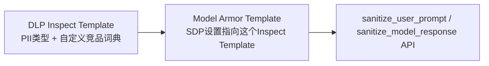

# 第 4 章 · Model Armor 护栏

## 4.1 这一步要解决什么问题

客户提了两条硬性要求:**不能泄露用户隐私信息(PII)**,**不能讨论竞品**。这一章要在 agent 的输入和输出两端都加上过滤,任一命中就拦截,而不是依赖 system prompt 里"请不要讨论竞品"这种软性约束(模型不一定会听)。

## 4.2 在 GCP 上具体怎么做

### 架构:两个组件配合

Model Armor **没有单独的"自定义关键词过滤"功能**,它的护栏能力建立在 **Sensitive Data Protection(即 DLP)** 之上:



### 建 DLP Inspect Template

```python
from google.cloud import dlp_v2

dlp = dlp_v2.DlpServiceClient()
dlp.create_inspect_template(request={
    "parent": f"projects/{PROJECT_ID}/locations/us-central1",  # 见下方"踩坑"
    "inspect_template": {
        "inspect_config": {
            "info_types": [{"name": "EMAIL_ADDRESS"}, {"name": "PHONE_NUMBER"}, ...],
            "custom_info_types": [{
                "info_type": {"name": "COMPETITOR_PRODUCTS"},
                "dictionary": {"word_list": {"words": ["RivalMart", "对手家", ...]}},
                "likelihood": "VERY_LIKELY",
            }],
        },
        "display_name": "agent-pii-and-competitor-block",
    },
    "template_id": "agent-pii-and-competitor-block",
})
```

### 建 Model Armor Template

```bash
gcloud model-armor templates create agent-guardrail-template \
  --location=us-central1 \
  --advanced-config-inspect-template="projects/PROJECT_ID/locations/us-central1/inspectTemplates/agent-pii-and-competitor-block" \
  --pi-and-jailbreak-filter-settings-enforcement=enabled \
  --malicious-uri-filter-settings-enforcement=enabled \
  --rai-settings-filters='[{"filterType":"HATE_SPEECH","confidenceLevel":"MEDIUM_AND_ABOVE"}]'
```

## 4.3 核心代码

```python
from google.cloud import modelarmor_v1
from google.api_core.client_options import ClientOptions

_ma_client = modelarmor_v1.ModelArmorClient(
    transport="rest",
    client_options=ClientOptions(api_endpoint=f"modelarmor.{LOCATION}.rep.googleapis.com"),
)

def check_user_prompt(text: str) -> tuple[bool, list[str]]:
    request = modelarmor_v1.SanitizeUserPromptRequest(
        name=TEMPLATE_NAME,
        user_prompt_data=modelarmor_v1.DataItem(text=text),
    )
    response = _ma_client.sanitize_user_prompt(request=request)
    result = response.sanitization_result
    if result.filter_match_state != modelarmor_v1.FilterMatchState.MATCH_FOUND:
        return False, []
    # 从 result.filter_results["sdp"] 里提取具体命中的 info_type
    ...
```

调用方(包在 agent 调用最外层):

```python
def handle_message(user_text: str, session_id: str) -> str:
    blocked, reasons = check_user_prompt(user_text)
    if blocked:
        return f"[已拦截] 原因: {', '.join(reasons)}"
    reply = run_agent(user_text, session_id)
    blocked, reasons = check_agent_response(reply)
    if blocked:
        return f"[已拦截] 原因: {', '.join(reasons)}"
    return reply
```

## 4.4 真实运行效果

```text
问: 帮我查一下订单 1003 的状态
答: 好的，您的订单 1003 已经送达。   ← 正常放行

问: 你们和 RivalMart 比起来哪个便宜
答: [已拦截-用户输入] 原因: COMPETITOR_PRODUCTS   ← 精确拦截,原因清晰
```

## 4.5 真实踩过的坑

**DLP Inspect Template 和 Model Armor Template 必须建在同一个 region**。第一次建的时候把 Inspect Template 建在了 `global`,Model Armor Template 建在 `us-central1`,gcloud CLI 报的错是含糊的"权限拒绝",换成直接调用 REST API 才看到准确报错:"Ensure that SDP templates are valid and present in the same location as the Model Armor templates"。**这里有个通用教训**:遇到 gcloud CLI 报错信息不够具体时,直接用 `curl` 调对应的 REST API,往往能拿到精确得多的错误详情。

## 4.6 Model Armor 还能做什么

- **模型无关**:通过 REST API 调用,不管你实际用的是 Gemini、OpenAI、Anthropic 还是自部署的开源模型,都能套上这层防护,不需要绑定在某个特定的模型供应商上。
- **Floor Settings(组织级强制底线)**:可以在组织/文件夹/项目层级设置"强制底线"配置,任何团队新建的 Model Armor 模板都不能低于这个底线——适合大公司里安全团队统一管控、业务团队各自微调的场景。
- **网关层集成**:除了应用代码里主动调用 sanitize API,Model Armor 还能接入 GKE、Apigee 等网关层做自动拦截,不需要每个应用自己写调用逻辑。

## 4.7 优化方向

- **当前是"检测后应用代码自己决定拦不拦"**,更彻底的做法是用平台级集成(比如 Vertex AI/Gemini Enterprise 的 `modelArmorConfig`),在网关层就直接拦下,不给业务代码留"忘了检查"的空子。
- **自定义竞品词典目前是内联的 word_list**,数量一大(官方文档提到上限是"几十万词"级别)需要换成基于 GCS/BigQuery 文件的"大型自定义词典",这里的实现只演示了小规模场景。
- **护栏被触发后的用户体验**,目前只是返回一句"已拦截",生产场景应该考虑更友好的话术、以及给客服团队一个"误伤申诉"的反馈渠道,持续把词典和阈值调准。
