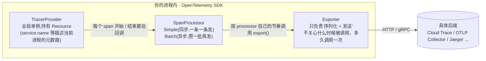
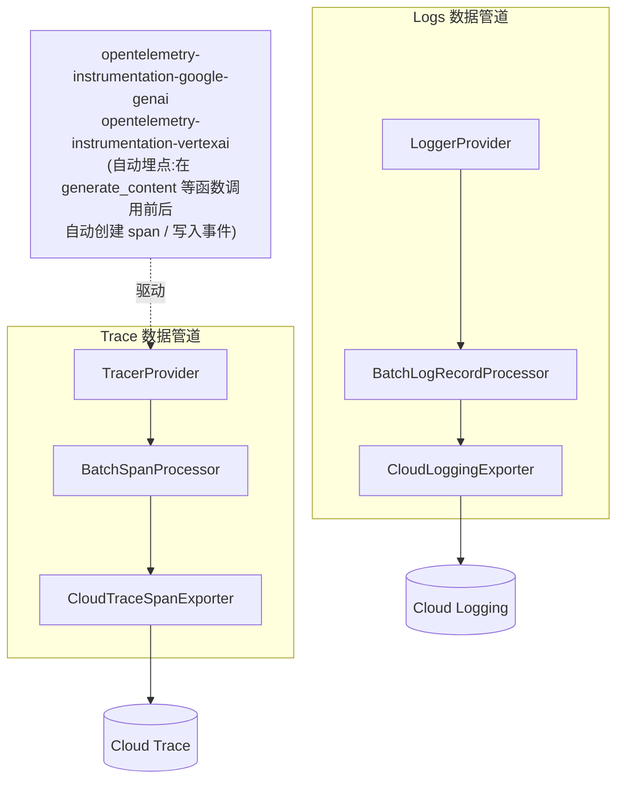
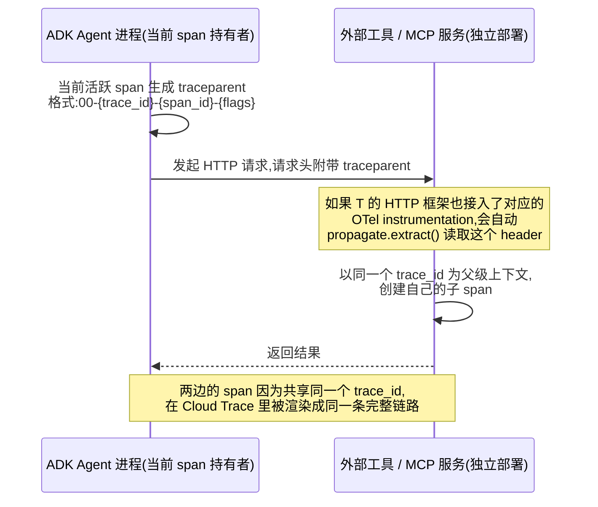

# 第 5 章 · 可观测性(Trace / Logging)

## 5.1 这一步要解决什么问题

Agent 出问题时(回答错了、卡住了、慢了),需要能追溯"这次对话到底经历了哪些步骤、每一步耗时多少、每个工具调用传了什么参数"——这就是可观测性存在的意义,而且客户方通常会明确要求"每次对话可审计"这条合规底线。

没有可观测性之前,排障基本靠猜。一次用户输入背后,`root_agent` 可能先判断要不要委派给某个 `sub_agent`,那个 `sub_agent` 可能调用了一到两次工具,工具可能重试过、可能超时过,最后模型才把结果组织成一句自然语言回复给用户。如果只盯着"最终回复文本",你能看到的只是这条链路的**结果**,看不到中间发生了什么——委派对象选错了没有?工具是被调用了一次还是被重复调用了三次?某一步耗时是 200ms 还是 8 秒?这些问题在没有 Trace 之前,只能靠在代码里疯狂加 `print()`/`logging.debug()` 去猜,而且这些散落的日志分布在不同的 sub_agent、不同的工具函数里,时间线经常对不上,一旦涉及多轮委派或者并发调用,基本没法拼出完整的因果链。

这一章对应的是真实项目 Phase 4 的内容,也是整本手册里踩坑最密集的一章。原因不是配置写错了这么简单——根子在于 **GenAI 相关的 OpenTelemetry 生态目前还处于快速演进期,很多关键的包还停留在 beta/alpha 阶段**,包与包之间的版本兼容性经常出现断层。这一点会在 5.2 和 5.5 节反复出现,是理解本章大部分坑的钥匙。

!!! note "为什么这一章踩的坑格外多"
    可观测性听起来像是一个"装好包、加个开关"就能解决的基础设施问题,但 ADK 在这件事上依赖的是一整套还在快速变化的 OpenTelemetry GenAI 生态——从自动埋点(instrumentation)到导出器(exporter)再到语义约定(semantic conventions)本身都还没有完全稳定下来。这意味着你今天装好能跑的一套包版本组合,几个月后升级 ADK 或者升级某个依赖包,很可能又需要重新对齐一遍版本。理解这一点之后,再看后面遇到的每一个 `ModuleNotFoundError`/`TypeError`,就不会觉得莫名其妙了。

## 5.2 在 GCP 上具体怎么做

### 5.2.1 先搞懂 OpenTelemetry 是什么:三层架构

在动手装包、加 CLI 参数之前,有必要把 OpenTelemetry(以下简称 OTel)的基本模型讲清楚,因为后面遇到的几乎所有报错,都是这三层里的某一层出了兼容性问题:



三层各自的职责边界是刻意设计出来的关注点分离:

- **TracerProvider**:整套体系的入口和全局单例,负责创建 `Tracer` 对象(代码里通过 `tracer.start_as_current_span(...)` 生成 span 用的就是它)。它还持有一个 `Resource`,描述"这个 span 是从哪个进程/服务产生的"这类元数据,比如 `service.name`。
- **SpanProcessor**:挂在 TracerProvider 上的生命周期钩子,每当一个 span 开始(`on_start`)或者结束(`on_end`)都会被回调一次。最常见的两种实现是 `SimpleSpanProcessor`(同步,span 一结束立刻调用 exporter,通常只用于本地调试)和 `BatchSpanProcessor`(异步,内部维护队列,攒够一批或者到了固定时间间隔才批量调用 exporter,这是生产环境的标准配置,细节见 5.3 节)。
- **Exporter**:只负责"把一批 span 序列化成目标后端能理解的格式,再通过网络发出去",完全不关心自己是被 Simple 还是 Batch processor 调用、调用频率是多少。这也是为什么同一个 `CloudTraceSpanExporter` 理论上可以自由搭配任意一种 processor 使用——两者之间没有耦合。

Logs 这一侧的结构是完全对称的一套体系:`LoggerProvider` → `LogRecordProcessor`(同样分 Simple/Batch)→ `LogExporter`。ADK 的 `--otel_to_cloud` 实际上是同时搭好了 Trace 和 Logs 这**两条独立的数据管道**:



### 5.2.2 ADK 如何接入这套体系,以及"包版本冲突"的根本原因

ADK 本身**不是**一个 tracing 库——它在启动阶段(web 服务器/runner 初始化时)调用的是标准 OpenTelemetry SDK 的 API,去构造上面这一整套 Provider/Processor/Exporter。真正让"模型调用""工具调用"这些动作自动产生 span 的,是另外两个专门的**自动埋点(auto-instrumentation)**包:`opentelemetry-instrumentation-google-genai` 和 `opentelemetry-instrumentation-vertexai`。它们的作用可以理解成一种"官方认可的猴子补丁"——在 `google-genai`/`vertexai` SDK 的关键函数(比如 `generate_content`)外面包一层,调用前自动开一个 span、调用后自动记录耗时和 token 用量,业务代码本身完全不需要手写任何埋点逻辑。

理解了这套接入方式,就能理解"为什么会有这么多包版本冲突"这个根本原因:

- `opentelemetry-instrumentation-google-genai`/`opentelemetry-instrumentation-vertexai` 这类 GenAI 专属的埋点包,版本号里带着 `b0`(beta)、`a0`(alpha)这样的后缀——**这些包自己都还认为没到稳定阶段**,接口随时可能有 breaking change。
- 它们各自对核心库 `opentelemetry-api`/`opentelemetry-sdk` 的版本依赖,有的钉得松、有的钉得紧,几个包放到一起装的时候,很容易出现"这个包要求 sdk >= 1.27,那个包却是照着 sdk 1.24 的接口写的"这种错位。
- 更麻烦的是,这些包背后依赖的 **gen_ai 语义约定本身也在变**(见 5.4.1 节)——不只是导出通道在变,连"该往 span 上挂什么属性、span 该叫什么名字"这个规范都还在修订中。

所以本章遇到的坑,本质上不是"某一行配置写错了",而是这套生态里各个环节的成熟度参差不齐导致的组合爆炸。养成"遇到 OTel 相关的报错先怀疑版本兼容性,而不是先怀疑自己代码写错了"这个直觉,会让排障效率高很多。

### 5.2.3 两个 CLI 参数,选新的那个

ADK 有两个开关:

| 参数 | 覆盖范围 | 状态 |
|---|---|---|
| `--trace_to_cloud` | 只导出 Cloud Trace | 较老的路径,在 `agent_engine` 部署目标上已标记弃用 |
| `--otel_to_cloud` | 同时导出 Cloud Trace **和** Cloud Logging | 当前推荐,ADK ≥ 1.17 |

```bash
adk web --otel_to_cloud --port 8001 .
```

需要提前 `export GOOGLE_CLOUD_PROJECT=...` 这类环境变量到 **shell 层面**,不能只写在 agent 包内部的 `.env` 里——tracing 的启用检查发生在 web 服务器启动阶段,比每个 agent 自己 `load_dotenv()` 还早。换句话说,ADK 在构造上一节提到的那套 TracerProvider/LoggerProvider 时,需要立刻知道"往哪个 GCP 项目导出",这个决策点在时间上先于任何一个 agent 包被真正加载、先于任何 agent 自己的 `.env` 被读取,所以只在 agent 包内部设置环境变量对这个初始化阶段是不可见的。

### 5.2.4 需要装的包,以及为什么

```bash
pip install \
  "opentelemetry-instrumentation-google-genai>=0.4b0" \
  "opentelemetry-instrumentation-vertexai>=2.0b0" \
  opentelemetry-exporter-gcp-logging \
  opentelemetry-exporter-otlp-proto-http \
  opentelemetry-exporter-gcp-trace
```

对照上面两张架构图,这五个包分别对应哪一层:

| 包 | 对应架构里的角色 | 成熟度 |
|---|---|---|
| `opentelemetry-instrumentation-google-genai` | 自动埋点:给 `google-genai` SDK 的调用自动打 span | beta(`b0`) |
| `opentelemetry-instrumentation-vertexai` | 自动埋点:给 `vertexai` SDK 的调用自动打 span | beta(`b0`) |
| `opentelemetry-exporter-gcp-trace` | Trace 管道的 Exporter,对应 `--trace_to_cloud`/`--otel_to_cloud` | 相对独立打包发布 |
| `opentelemetry-exporter-gcp-logging` | Logs 管道的 Exporter,对应 `--otel_to_cloud` | alpha(`a0`),见 5.5 节的坑 |
| `opentelemetry-exporter-otlp-proto-http` | ADK 源码内部实际 import 的 OTLP HTTP 变体依赖 | 相对成熟,但容易被常见资料忽略 |

后面两个包的踩坑经历见 5.5 节——这里先记住一个关键点:**这份依赖列表不是从任何官方"快速开始"文档里抄来的,是根据实际的 `ModuleNotFoundError` 报错倒推出来的真实组合**。网上很多资料只提到 OTLP 的 gRPC 变体,但 ADK 源码实际 import 路径走的是 HTTP 变体,按 gRPC 那一套装包会在启动时立刻报错。

## 5.3 核心代码 / 排障

### 5.3.1 批处理导出器的工作原理:队列、定时器、force_flush

这是本章最容易被忽略、也最反直觉的一点。5.2.1 提到 `BatchSpanProcessor`/`BatchLogRecordProcessor` 是生产环境的标准配置,但它们的"批处理"具体是怎么工作的,值得展开讲清楚——不理解这一点,你会以为"发了一条消息、Trace 却查不到"是导出失败了,但其实很可能只是还没到导出的时机。

批处理 processor 内部本质上是一个**有界队列 + 一个后台工作线程**:

1. 每次一个 span/log 结束,processor 的 `on_end` 钩子被调用,把这条数据塞进内部队列,**立刻返回**,不做任何网络调用——这一步几乎零开销,是批处理设计的核心目的:不能让每一次工具调用/模型调用都因为"顺便发一次网络请求去 Cloud Trace"而变慢。
2. 后台有一个独立的工作线程,按照两个条件之一触发真正的导出动作:
    - **队列里攒够了一批**(达到 `max_export_batch_size`,OTel 规范里给出的默认值通常是 512条);
    - **或者到了固定的调度间隔**(`schedule_delay_millis`,规范默认值通常是 5000 毫秒,即 5 秒)。
    - 队列本身也有总容量上限(`max_queue_size`,规范默认值通常是 2048),如果生产速度长期超过导出速度,队列满了之后新数据会被丢弃而不是无限堆积占用内存。
3. 触发导出时,工作线程才会真正调用 exporter 的 `export()` 方法,把这一批数据发送给 Cloud Trace/Cloud Logging,这一步才有真实的网络请求和延迟(受 `export_timeout_millis` 限制,规范默认值通常是 30000 毫秒)。

这套设计带来的直接后果是:**如果你的服务是那种"一直跑着不重启"的常驻进程,发一条消息之后立刻去 Cloud Trace 控制台查,大概率查不到**——不是没导出成功,只是这条 span 还静静地躺在内存队列里,没到"攒够一批"或者"到了调度间隔"这两个触发条件里的任何一个。这个现象非常反直觉,因为大部分开发者的第一反应是去怀疑权限、怀疑网络、怀疑代码哪里写错了,而不会想到"只是还没刷新"。

`force_flush()` 就是为了解决这个反直觉现象而存在的方法——它**绕过**上面第 2 步提到的两个触发条件(队列攒够、定时器到点),直接强制工作线程立刻把队列里现有的所有数据发送出去,不用等。ADK/OTel SDK 通常会在进程收到优雅终止信号时,通过注册好的退出钩子自动调用一次 `force_flush`(再调用 `shutdown`),这也是为什么"优雅退出"和"暴力杀掉进程"这两种终止方式,对 Trace 数据能不能导出成功会有本质区别:

```bash
# 优雅终止(不是kill -9),触发force_flush
pkill -TERM -f "adk web"
```

!!! warning "kill -9 和 pkill -TERM 的区别不是细节,是本章最容易踩的坑之一"
    `kill -9`(`SIGKILL`)是操作系统直接强行终止进程,进程完全没有机会执行任何清理代码,包括 `force_flush`——这意味着当时还留在批处理队列里、没来得及导出的那部分 span/log 会随着进程退出而彻底丢失,不会出现在 Cloud Trace/Cloud Logging 里,而且没有任何报错提示你"丢了"。`pkill -TERM`(`SIGTERM`)则是发送一个"请优雅退出"的信号,给进程留出机会执行退出前的清理逻辑,包括把队列里剩下的数据强制刷新出去。调试阶段如果发现"明明发了消息,Trace 里就是没有",第一步应该是用优雅终止方式重启进程(或者等待调度间隔过去),而不是怀疑导出链路本身坏了。

### 5.3.2 用 REST API 直接验证(比等控制台刷新更快确认)

```bash
TOKEN=$(gcloud auth print-access-token)
curl -H "Authorization: Bearer $TOKEN" \
  "https://cloudtrace.googleapis.com/v1/projects/PROJECT_ID/traces/TRACE_ID_HEX32"
```

trace_id 需要转成 32 位十六进制(前导零不能省):

```python
print(format(trace_id_int, '032x'))
```

!!! tip "为什么不直接刷新控制台页面就好"
    Cloud Trace 控制台的列表页/搜索页本身也有自己的索引刷新延迟,再加上上面提到的批处理导出延迟,两层延迟叠加在一起,单纯"刷新页面"很难判断到底是数据还没导出,还是控制台索引还没跟上。直接用 REST API 按 trace_id 精确查询,能跳过控制台这一层不确定性,如果 API 直接返回 404/空结果,基本可以确定问题出在导出这一侧,而不是控制台展示这一侧——这个区分在排障时非常关键,决定了你接下来该往哪个方向查。

## 5.4 真实运行效果(Cloud Trace 里的调用链)

```text
invocation
└─ invoke_agent root_agent
   └─ call_llm → generate_content → execute_tool transfer_to_agent (分派给order_agent)
└─ invoke_agent order_agent
   └─ call_llm → generate_content → execute_tool get_order_status (真实调用订单API)
   └─ call_llm → generate_content (生成最终回复文本)
```

每个 span 都带真实的开始/结束时间、工具参数、工具返回值、token 用量。Cloud Logging 里的每条日志还会自动带 `trace` 字段,和对应的 Trace 关联,在控制台点开一条 trace 能直接看到"Logs & Events"标签页里的相关日志。

### 5.4.1 gen_ai 语义约定:为什么 span 名字/属性长这样

你可能会好奇,为什么这些 span 的名字恰好叫 `invoke_agent {agent_name}`、`call_llm`、`execute_tool {tool_name}`,而不是 ADK 或者 Google 自己随便起的名字。这背后是 **OpenTelemetry GenAI 语义约定(GenAI Semantic Conventions)** 这套规范在起作用——它定义了"一个大模型调用/agent 调用/工具调用应该被记录成什么样的 span 名字、应该携带哪些标准化的属性(attribute)",目的是让不同厂商、不同框架产生的可观测性数据能有一套统一的"词汇表"。

这套约定里比较稳定的一批属性大致包括(具体字段会随规范版本略有调整):

| 属性 | 含义 |
|---|---|
| `gen_ai.system` | 用的是哪家的模型/服务(比如 `vertex_ai`、`gemini`) |
| `gen_ai.request.model` / `gen_ai.response.model` | 请求时指定的模型名 / 实际响应的模型名 |
| `gen_ai.operation.name` | 这次调用的操作类型(比如 `chat`、`generate_content`) |
| `gen_ai.usage.input_tokens` / `gen_ai.usage.output_tokens` | 输入 / 输出 token 用量,可以直接拿去做成本分析 |
| `gen_ai.tool.name` | 被调用的工具名字,对应 span 树里 `execute_tool` 这一层 |

之所以要遵循这样一套标准命名,而不是每个框架自己发明一套,核心原因是**互操作性**:如果你的可观测性后端不止 Cloud Trace 一个——比如同时接了 Grafana、Datadog、Honeycomb,或者专门做 LLM 可观测性的 Langfuse 之类的工具——这些后端只要都认识 `gen_ai.*` 这套语义约定,就能用同一套逻辑去解析、聚合、展示这些 span,不需要为每一个 agent 框架单独写一层适配代码。这也是为什么本章前面提到的"优化方向"里,`gen_ai.usage.output_tokens` 这类字段可以直接拿去做 log-based metric(见 5.6.1 节)——因为它是标准化命名,不是 ADK 自己发明的私有字段。

!!! note "这套规范本身也还在演进,呼应前面提到的'生态不成熟'"
    OpenTelemetry 官方把 GenAI 语义约定标记为"Development"/"实验性"状态——也就是说,这套规范本身还在修订中,字段名字、span 命名规则在不同版本之间可能发生变化。这和 5.2.2 节提到的包版本冲突问题是同一个根源:不只是导出通道(exporter)还不成熟,连"数据应该长什么样"这个规范本身也还没有完全定型。如果你在升级 ADK 或者相关 instrumentation 包版本之后,发现 Cloud Trace 里 span 的名字或者属性字段跟以前不一样了,不要惊讶,先去看对应版本的 changelog,这通常是跟着上游语义约定的修订走的。

### 5.4.2 Trace 和 Logging 是怎么关联到一起的

前面提到"Cloud Logging 里的每条日志还会自动带 `trace` 字段"——这不是巧合,而是 5.2.1 节图里画的两条独立管道(Trace 管道、Logs 管道)在写入时共享了同一个 `trace_id`。具体来说,当前活跃的 span 会把自己的 `trace_id` 注入到同一时刻产生的日志记录里,写入 Cloud Logging 时形成形如 `projects/PROJECT_ID/traces/TRACE_ID_HEX32` 的 `trace` 字段。这也是为什么在 Cloud Trace 控制台里点开一条 trace,能直接跳转到"Logs & Events"标签页看到对应的结构化日志——两边的数据在写入阶段就已经用同一个标识符关联好了,不需要你手动去凑时间戳做人工对齐。

## 5.5 真实踩过的坑

这一章踩坑最密集,按顺序列出(每一个都是真实的包生态断层,不是配置写错了):

| 报错 | 根因 | 解决 |
|---|---|---|
| `ModuleNotFoundError: opentelemetry.exporter.otlp.proto.http` | ADK 源码实际 import 的是 OTLP **HTTP** 变体,不是常见资料里提到的 gRPC 变体 | `pip install opentelemetry-exporter-otlp-proto-http` |
| `ModuleNotFoundError: opentelemetry.exporter.cloud_trace` | `--trace_to_cloud` 走的是另一个独立包 | `pip install opentelemetry-exporter-gcp-trace` |
| `TypeError: Can't instantiate abstract class CloudLoggingExporter ... force_flush` | `opentelemetry-exporter-gcp-logging` 还是 alpha 版本(1.12.0a0),没跟上 `opentelemetry-sdk` 把 `force_flush` 收紧成强制抽象方法这次变化 | 见下方猴子补丁 |

第三个坑值得停下来单独讲清楚,因为它不只是"装个补丁绕过去"这么简单,背后是 Python `abc` 模块一个容易被误解的机制。

### 5.5.1 猴子补丁修 alpha 包的 ABC 冲突

```python
# sitecustomize.py,放在venv的site-packages目录下,Python解释器启动时自动加载
from opentelemetry.exporter.cloud_logging import CloudLoggingExporter

if "force_flush" in CloudLoggingExporter.__abstractmethods__:
    def _force_flush(self, timeout_millis: int = 30000) -> bool:
        return True
    CloudLoggingExporter.force_flush = _force_flush
    # 只赋值方法不够 —— ABCMeta在类创建时就把__abstractmethods__冻结了,
    # 运行时打补丁必须显式把这个方法名从集合里摘掉
    CloudLoggingExporter.__abstractmethods__ = frozenset(
        m for m in CloudLoggingExporter.__abstractmethods__ if m != "force_flush"
    )
```

这个补丁本身也是一次真实的技术教训:**给类属性赋值一个具体实现,不代表 Python 的 ABC 机制会自动认为这个抽象方法"被满足了"**——`__abstractmethods__` 是类创建时计算并冻结的 frozenset,运行时 monkey-patch 必须连这个集合一起手动更新。

### 5.5.2 为什么"赋值一个方法"不够:Python ABC 机制的原理

这里的坑本质上是:`opentelemetry-sdk` 某个版本更新之后,把 `LogExporter` 这个抽象基类里的 `force_flush` 方法标记成了**必须实现的抽象方法**(用 `@abc.abstractmethod` 装饰),而 `opentelemetry-exporter-gcp-logging` 这个 alpha 包发布的时候,还没跟上这次变化,它定义的 `CloudLoggingExporter` 类没有实现 `force_flush`。于是一旦代码尝试 `CloudLoggingExporter(...)` 实例化,Python 立刻抛出 `TypeError: Can't instantiate abstract class ...`,连带一起提到还缺哪个方法。

要理解为什么"直接赋值一个 `force_flush` 方法"解决不了问题,需要知道 `abc.ABCMeta`(Python 里所有 ABC 类背后的元类)具体是怎么工作的:

1. **类创建时**,`ABCMeta.__new__` 会扫描这个类自己定义的方法,以及它所有基类已经算出来的 `__abstractmethods__`,对每一个名字检查它对应的值是否带有 `__isabstractmethod__ = True` 这个标记。凡是"还没有被具体实现覆盖"的抽象方法名字,都会被收集进一个 `frozenset`,赋值给这个类的 `__abstractmethods__` 属性。**这一步只在类被定义的那一刻执行一次**,之后不会自动重新计算。
2. **实例化时**(执行 `ClassName(...)` 这行代码触发),Python 会检查目标类的 `cls.__abstractmethods__` 这个 frozenset 是否非空——如果非空,直接抛出 `TypeError`,列出还缺哪些方法。**这一步检查的是那个已经冻结好的 frozenset,不会重新扫描类当前所有方法的定义**。

问题就出在这两步的时间差上:当你后来执行 `CloudLoggingExporter.force_flush = _force_flush` 这行赋值时,确实往这个类上挂了一个具体的、能正常调用的方法——如果这时候直接调用一个已经存在的实例的 `.force_flush()`,是能正常工作的。但**实例化检查看的不是"这个方法现在能不能正常调用",而是那个在类创建时就已经计算并冻结好的 `__abstractmethods__` frozenset**,这个 frozenset 不会因为你后来给类添加了一个同名方法就自动把这个名字摘除。所以哪怕方法本身已经补好了,`CloudLoggingExporter(...)` 这行实例化代码依然会因为 frozenset 里还留着 `"force_flush"` 这个名字而继续报同样的 `TypeError`——这也是为什么补丁代码里必须多加最后那一步,手动重建一个不包含 `"force_flush"` 的新 frozenset 赋值回去。

用一个和项目无关、纯粹演示 Python 标准库行为的最小例子会更直观(这不是项目里的真实代码,只是复现 `abc` 模块本身的原理):

```python
import abc

class Base(abc.ABC):
    @abc.abstractmethod
    def force_flush(self): ...

# 此时 Base.__abstractmethods__ == frozenset({'force_flush'})

class Sub(Base):
    pass  # 没有实现 force_flush,类创建时 ABCMeta 就把它标记为still abstract

# Sub.__abstractmethods__ 在类创建的那一刻就被计算为 frozenset({'force_flush'})
# Sub()  # TypeError: Can't instantiate abstract class Sub with abstract method force_flush

Sub.force_flush = lambda self: True   # 只是普通的属性赋值,不会触发ABCMeta重新计算
# Sub.__abstractmethods__ 依然是 frozenset({'force_flush'}) —— 已经冻结,不会自动更新
# Sub()  # 仍然会抛出同样的 TypeError!

Sub.__abstractmethods__ = frozenset()  # 必须手动清空/摘除对应的名字
Sub()  # 现在才能实例化成功
```

理解了这一层原理之后,这个补丁就不再是一段"背下来的黑魔法",而是一次对症下药:**它同时做了两件事——补上缺失的具体实现(让方法本身能正常工作),以及手动修正类创建时就已经冻结的 `__abstractmethods__` frozenset(让实例化检查能通过)**。少做其中任何一步,补丁都不完整。

## 5.6 Cloud Trace / Logging 还能做什么

### 5.6.1 Cloud Monitoring 告警:基于 Trace/Logging 数据配置一个例子

光是把数据导出到 Cloud Trace/Cloud Logging 还不够,真实项目里更希望做到"出问题自动通知我",而不是靠人肉盯着控制台。这条路径的基本思路是:**先把结构化日志里的某个字段转换成一个 Log-based Metric,再基于这个指标配置一条告警策略**。

以"agent 工具调用失败次数"为例,第一步是从 Cloud Logging 里定义一个 log-based metric,给它一个过滤条件,凡是命中这个条件的日志都会被计入这个指标:

```bash
gcloud logging metrics create tool_execution_error_count \
  --description="Agent 工具调用失败事件计数" \
  --log-filter='resource.type="global"
    AND severity>=ERROR
    AND jsonPayload.event_name="execute_tool"'
```

有了这个指标之后,第二步是定义一条 Cloud Monitoring 告警策略,规则大致是"这个指标在过去 5 分钟内的计数超过某个阈值就触发":

```json
{
  "displayName": "Agent工具调用失败率过高",
  "conditions": [
    {
      "displayName": "tool_execution_error_count 超过阈值",
      "conditionThreshold": {
        "filter": "resource.type=\"global\" AND metric.type=\"logging.googleapis.com/user/tool_execution_error_count\"",
        "comparison": "COMPARISON_GT",
        "thresholdValue": 5,
        "duration": "300s",
        "aggregations": [
          {
            "alignmentPeriod": "300s",
            "perSeriesAligner": "ALIGN_RATE"
          }
        ]
      }
    }
  ],
  "combiner": "OR",
  "notificationChannels": [
    "projects/PROJECT_ID/notificationChannels/NOTIFICATION_CHANNEL_ID"
  ]
}
```

```bash
gcloud alpha monitoring policies create --policy-from-file=policy.json
```

这套组合(log-based metric + 告警策略)不局限于错误计数,原则上任何结构化字段都能拿来做类似的事情——比如前面 5.4.1 提到的 `gen_ai.usage.output_tokens`,同样可以做成一个指标,用来监控 token 成本是不是突然暴涨;或者针对某个 span 的耗时字段设置 P99 延迟告警,替代人工每天打开控制台巡检。

### 5.6.2 跨服务的分布式追踪:traceparent 传播机制

如果 agent 调用的工具本身是另一个独立部署的服务(比如一个独立部署的 MCP 服务器,或者客户自己的下游 API),单靠 agent 进程内部的 span 树是不完整的——你只能看到"agent 发起了一次调用,过了 800ms 收到响应",看不到这 800ms 里下游服务内部具体做了什么。要把两边的 trace 串成一条完整链路,靠的是 OpenTelemetry 的 **`traceparent` 传播机制**,这是 W3C Trace Context 规范定义的一个标准 HTTP 请求头,格式大致是 `00-{trace_id}-{parent_span_id}-{trace_flags}`。



这套机制能正常工作的前提是**两端都要参与**:发起方需要在出站请求上自动注入 `traceparent`(通常靠对 HTTP 客户端库本身做自动埋点来实现),接收方需要能读取这个请求头并以此延续同一个 trace,而不是凭空开启一条全新的、彼此独立的 trace。

!!! warning "跨服务传播目前并不总是可靠"
    ADK 社区已有多个 issue 反馈,这个跨服务的 `traceparent` 传播在某些工具调用路径下并不总是自动生效——取决于具体走的是哪个 HTTP 客户端库、这个客户端库是否也被相应的 instrumentation 包覆盖到。如果发现 Cloud Trace 里 agent 侧和下游服务侧的 trace 各自独立、串不到一起,通常需要在调用工具的那一层手动介入,比如通过 `header_provider` 这类扩展点,在发起请求前手动从 `opentelemetry.trace.get_current_span()` 拿到当前上下文,用 W3C Trace Context 的传播器手动把 `traceparent` 塞进请求头,而不是完全依赖自动埋点。

### 5.6.3 其他值得了解的延伸能力

- **Log Router Sink 长期归档**:Cloud Trace/Cloud Logging 都不是为了无限期保存数据设计的(官方文档提到 Cloud Trace 数据的默认保留时长在 30 天左右),如果客户的合规要求需要更长的审计留存期,可以配置 Cloud Logging 的 Log Router,把日志实时导出到 BigQuery 或者 GCS 做长期归档,之后用 SQL 做更复杂的离线分析,而不是受限于控制台默认的保留期和查询能力。
- **Error Reporting 自动聚合**:如果导出到 Cloud Logging 的错误日志格式符合 Error Reporting 能识别的堆栈样式,它会自动把同类报错聚合成一个"错误组",统计出现频率和影响范围,不需要自己再写一套报错去重/聚合逻辑,适合报错种类多、需要快速看出"哪一类错误最值得优先修"的场景。
- **Trace 的聚合分析报告**:除了逐条查看单个 trace,Cloud Trace 本身也提供延迟分布这类聚合视角的报告能力,适合定期回顾"最近这段时间整体延迟趋势有没有变差",而不必逐条翻看单次调用的详情。

## 5.7 优化方向

### 5.7.1 给追踪数据打上业务标签

给追踪数据打上业务标签,比如客户 ID、对话渠道,方便按业务维度筛选和统计,而不只是按 agent/session 维度。具体做法是在当前 span 上追加自定义属性(而不是依赖 gen_ai 语义约定里那批标准字段),这样在 Cloud Trace 里筛选、或者基于这些自定义字段做 log-based metric 的时候,能直接按业务口径切片,而不需要每次都先靠 session_id 反查对应的客户信息。

### 5.7.2 采样策略:Head-based vs Tail-based

本章为了教学演示,全程是全量导出(每一条对话产生的所有 span 都会被导出)。真实高流量场景下,这样做 Trace/Logging 的存储和查询成本会显著增加,需要引入采样。采样策略里有两种本质不同的思路,分别适合不同场景:

| 维度 | Head-based Sampling | Tail-based Sampling |
|---|---|---|
| 决策时机 | trace 一开始(第一个 span 创建时)就决定"要不要采样" | 等这个 trace 下所有 span 都收集完之后才决定"留不留" |
| 决策依据 | 通常是固定比例/概率(比如 10%),或者基于 trace_id 做确定性哈希 | 可以基于业务规则,比如"这个 trace 里有没有报错 span""整体耗时是否超过某个阈值" |
| 实现位置 | 应用进程内部,由 OTel SDK 的 `Sampler` 接口决定(比如 `TraceIdRatioBased`) | 需要一个能看到完整 trace 的中间层,比如 OpenTelemetry Collector 的 `tail_sampling` processor |
| 适合场景 | 高流量、成本敏感、只需要统计意义上的延迟/吞吐分布 | 低频但高价值的异常排查场景——只想留下报错的、慢的那部分对话,别的可以丢弃 |
| 代价 | 可能恰好把你想排查的那一条"问题 trace"随机丢弃掉 | 需要额外的基础设施(Collector),而且必须缓冲一个 trace 下的所有 span 直到它"结束"才能做决策,有额外的延迟和内存开销 |

OpenTelemetry Python SDK 默认的 sampler 是 `ParentBased(AlwaysOn)`(根 trace 默认全部采样),可以通过标准环境变量调整成按比例采样,比如 `OTEL_TRACES_SAMPLER=parentbased_traceidratio` 搭配 `OTEL_TRACES_SAMPLER_ARG=0.1` 表示只保留 10% 的根 trace。这属于 head-based 采样,决策在 trace 刚开始时就已经确定,后续这条 trace 里所有 span 会保持一致(要么全采样,要么全不采样)。

如果目标是"只想保留有问题的对话",本质上要求在决定丢弃之前,就已经看到这个 trace 下的所有 span——单个 agent 进程视角是无法预知一个 trace 最终会不会出错、会不会慢的,所以业界标准做法是把所有 span 先统一发到一个独立部署的 OpenTelemetry Collector,由 Collector 配置 `tail_sampling` processor,攒够同一个 trace_id 下的全部 span 之后再统一做出采样决定,再转发给 Cloud Trace。这种做法的部署成本明显更高(需要额外维护一个 Collector 网关),所以更适合那些"数据量大到必须采样,但又特别在意不能漏掉异常样本"的场景;单纯为了控制成本、不特别在意漏掉个别样本的场景,head-based 的比例采样通常已经够用,也更简单。

### 5.7.3 内容捕获(message content capture)的隐私合规考量

`OTEL_INSTRUMENTATION_GENAI_CAPTURE_MESSAGE_CONTENT` 控制是否把完整的 prompt/response 文本导出到 Trace/Logging 里——这不是一个默认打开就万事大吉的开关,而是一个需要认真对待的隐私合规问题:一旦打开,用户对话里的原始文本会实实在在地落地到可观测性系统里,而这套系统的访问权限、保留策略,通常和你的核心业务数据库是两套完全不同的治理体系,很容易被忽略。

具体来说,agent 对话内容里可能包含下面这几类敏感程度不同的信息,需要区别对待:

| 类别 | 典型字段 | 是否应该原样落地到 Trace/Logging |
|---|---|---|
| 直接身份标识 PII | 姓名、手机号、邮箱、身份证/护照号、住址 | 不应该——这一批和第 4 章 Model Armor 护栏里 DLP `info_types` 覆盖的类型是同一批 |
| 支付/账户信息 | 银行卡号、CVV、账户余额 | 绝对不应该,哪怕前端已经有护栏拦截,落地可观测性系统前也建议再脱敏一层做纵深防御 |
| 业务敏感信息 | 客户的订单详情、合同条款、内部价格策略 | 视客户合规要求而定,通常需要客户方安全团队明确给出"哪些字段允许记录"的清单,而不是工程团队自行判断 |
| 认证凭据 | API Key、Token、Session ID | 不应该——这类字段即便原始存储做了加密,可观测性系统本身的访问控制粒度通常比业务数据库宽松得多,一旦记录进去反而扩大了泄露面 |
| 模型原始输出全文 | 完整的 prompt/response 文本 | 默认建议脱敏或只记录摘要/统计信息,只在有明确合规豁免、且访问权限已经收紧的调试环境里才考虑全量开启 |

对应的脱敏思路,可以按成本从低到高排列:

1. **环境隔离优先**:只在权限收紧、有独立数据保留策略的"调试/预发布"环境里打开完整内容捕获,生产环境默认关闭,或者只保留 token 数量这类元数据,不落地原始文本——这是成本最低、也最容易落地的一道防线。
2. **复用第 4 章已经建好的 DLP 能力**,在写入 Trace/Logging 之前先过一遍 `deidentify_content`,把命中的敏感信息替换成占位符,而不是简单粗暴地整体丢弃这个字段(整体丢弃会让排障失去上下文,替换成占位符至少能看出"这里原本有一个手机号"):

    ```python
    from google.cloud import dlp_v2

    def redact_before_logging(text: str, project_id: str) -> str:
        dlp = dlp_v2.DlpServiceClient()
        response = dlp.deidentify_content(request={
            "parent": f"projects/{project_id}/locations/us-central1",
            "deidentify_config": {
                "info_type_transformations": {
                    "transformations": [{
                        # 替换成形如 [PHONE_NUMBER] 这样的占位符,而不是整段删除
                        "primitive_transformation": {
                            "replace_with_info_type_config": {}
                        }
                    }]
                }
            },
            "inspect_config": {
                "info_types": [{"name": "PHONE_NUMBER"}, {"name": "EMAIL_ADDRESS"}],
            },
            "item": {"value": text},
        })
        return response.item.value
    ```

    这一步的代价是每次记录都多一次 DLP API 调用,会引入额外延迟,适合对准确率要求更高、量级不算特别大的场景。

3. **保留期限对齐**:即便已经做了脱敏,依然要和客户确认 Trace/Logging 的保留期限设置是否符合他们的合规要求——不要用系统默认的保留策略一刀切,Cloud Logging 支持在建 log bucket 时单独指定保留时长,应该按客户的具体要求单独配置,而不是假设默认值就是合适的。

!!! danger "content capture 不是一个纯技术决策"
    是否打开完整内容捕获、脱敏到什么粒度、保留多久,这些问题的答案不应该由工程团队单方面拍板,而应该和客户的法务/合规/安全团队明确对齐清单和口径——本章能提供的是"技术上怎么做"的思路,但"该不该记录""记录多久"这类判断,最终需要客户方给出明确的合规要求作为依据。
