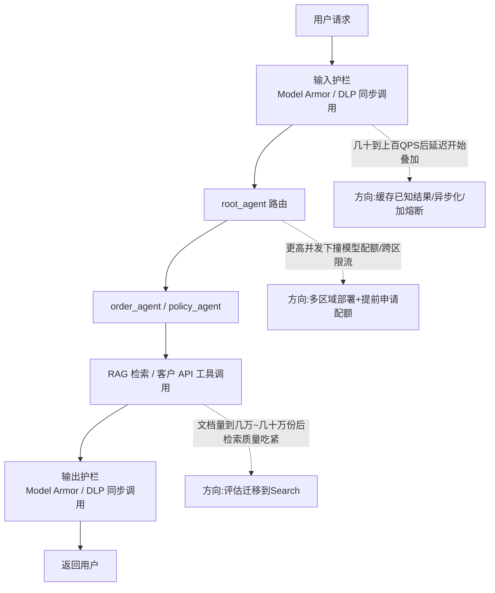

# 第 8 章 · 优化方向与附录

前面七章按照实际搭建顺序,一步步把 agent、工具、RAG、护栏、可观测性、部署、评估拼了起来。这一章不对应任何一个具体的 Phase,而是把视角拉高一层——横向汇总"这套系统作为一个整体,离真正的生产可用还差什么",并且补上几份实战中真正用得上的速查资料。如果说前七章是"怎么把每一块拼上",这一章就是"拼完之后,回头审视这堆积木整体够不够结实"。

## 8.1 全局性优化清单

前面每章都有各自维度的优化建议,这里再往上抬一层视角,整理几条**跨模块的、真正决定这套系统能不能撑到生产环境的**问题。这几条不是"锦上添花"式的建议,而是这个项目目前的架构里**确实存在的缺口**——如果现在就要把手册里搭出来的东西原样交给客户上线,下面这些是会被生产流量真实撞出来的问题,不是纸上谈兵的合规检查项。

### 架构层面

#### 1. 护栏没有跟着 agent 一起部署,这是当前最大的架构漏洞

第 4 章搭出来的 Model Armor 护栏,实现方式是`handle_message()`这个函数在**业务代码**里手动调用`check_user_prompt()`和`check_agent_response()`,把真正的 agent 调用（`run_agent()`）包在中间。这个设计在本地开发、本地调试阶段完全没问题——但第 6 章把 agent 部署到 Agent Runtime 之后,问题就出现了:客户真正调用的入口,是`remote_agent.stream_query(...)`这个 Python SDK 方法,或者直接打 REST API 的`reasoningEngines:streamQuery`。这两条调用路径,都**不会经过**本地写的那个`handle_message()`包装函数——它只存在于本地开发机的调用脚本里,根本没有跟着`adk deploy agent_engine`一起被打包上云。也就是说,手册跑到第 6 章部署完成的那一刻,线上的 agent 实际上是**没有护栏的**,第 4 章辛辛苦苦建的 DLP 词典和 Model Armor 模板全部形同虚设。这是一个很容易被"demo 效果很好"掩盖的坑——本地测试的时候永远是走`handle_message()`这条路径,护栏看起来工作得很好,直到有人直接用第 6 章教的方式调用部署好的 agent,才会发现输出完全没有经过检查。

要修正这个问题,核心思路是把护栏检查从"业务代码手动包一层"改造成"agent 自带的回调钩子",让它跟着 agent 定义一起被序列化、一起被部署。ADK 给`LlmAgent`提供了`before_model_callback`/`after_model_callback`(以及`before_tool_callback`/`after_tool_callback`)这一组回调点,分别在"请求发给模型之前"和"模型返回结果之后"执行,这正好对应第 4 章`check_user_prompt`和`check_agent_response`两次检查该发生的位置:

```python
# 示意代码——展示的是"回调架构该怎么接",不是可以直接照抄运行的完整实现。
# 复用第4章已经写好、跑通过的 check_user_prompt() / check_agent_response(),
# 区别只是调用的位置:从"业务代码手动包一层"变成"agent自带的回调钩子"。

def guardrail_before_model(callback_context, llm_request):
    """before_model_callback:在请求真正发给 Gemini 之前执行。"""
    user_text = _extract_latest_user_text(llm_request)   # 只取最新一轮用户输入,不重复扫描历史
    blocked, reasons = check_user_prompt(user_text)
    if blocked:
        # 回调返回一个非 None 的响应对象时,ADK 会把它当作"模型已经给出回复",
        # 不再真的把请求发给 Gemini —— 这是短路拦截的关键机制。
        # 具体的响应对象怎么构造、从哪个模块 import,以你当前安装的 ADK 版本的
        # callback 文档为准,这里示意的是返回值的语义,不是逐字可复制的实现。
        return build_blocked_response(f"[已拦截] 原因: {', '.join(reasons)}")
    return None  # 返回 None 表示放行,继续走正常的模型调用

def guardrail_after_model(callback_context, llm_response):
    """after_model_callback:在拿到模型输出之后、返回给上游之前执行。"""
    reply_text = _extract_text(llm_response)
    blocked, reasons = check_agent_response(reply_text)
    if blocked:
        return build_blocked_response(f"[已拦截] 原因: {', '.join(reasons)}")
    return None

root_agent = LlmAgent(
    name="root_agent",
    model="gemini-2.5-flash",
    instruction="...",
    sub_agents=[order_agent, policy_agent],
    before_model_callback=guardrail_before_model,
    after_model_callback=guardrail_after_model,
)
```

这里有个容易漏掉的细节:**`root_agent`自己不带工具,真正生成最终回答的往往是`order_agent`或`policy_agent`这两个子 agent**(参见第 2、3 章)。ADK 的多智能体分派机制里,子 agent 是独立调用模型的,它们各自的模型调用**不会**经过`root_agent`的`after_model_callback`。这意味着如果只在`root_agent`上挂护栏回调,`order_agent`/`policy_agent`真正吐出来的文本反而是不设防的——护栏回调需要在每一个会直接生成面向用户文本的 agent 上都挂一份,而不是只挂在最外层的路由 agent 上。这也是这套多智能体架构下,护栏设计比单 agent 场景更容易出纰漏的地方。

!!! warning "回调是同步阻塞调用,会给延迟预算记一笔账"
    把 Model Armor 的`sanitize_user_prompt`/`sanitize_model_response`挪进回调之后,每一次模型调用前后都会多一次同步的 REST 调用延迟。低并发场景基本感知不到,但这笔延迟成本在 8.4 节讨论扩展性边界时会重新出现——护栏调用是并发升高之后最先在关键路径上拖后腿的环节之一。同时还需要拍板一个业务决策:**护栏服务本身超时或者报错时,应该放行（fail-open）还是拦截（fail-closed）？**安全类场景通常倾向 fail-closed——宁可误伤一次正常请求,也不要在护栏故障时放行一条本该被拦截的内容——但这意味着 Model Armor 服务本身的可用性故障会直接变成整个 agent 的不可用故障,这个取舍需要提前和客户对齐,不能等出了事故才第一次讨论。

如果不想让业务代码自己承担"什么时候该拦"的判断逻辑,更彻底的路线是走平台级集成——第 4 章优化方向里提到的`modelArmorConfig`网关层配置,让检查发生在 Gemini Enterprise Agent Platform 的网关层,业务代码完全不需要显式调用 sanitize API,也就不存在"忘了在某条调用路径上包一层"的问题。这条路线的代价是需要评估当前 ADK/Agent Runtime 版本对这类网关级配置的支持程度,属于需要单独调研验证的事项,不在这份手册的实测范围内。

#### 2. RAG、Model Armor、可观测性三者独立搭建,应该用 IaC 收敛成一份可复现配置

回顾一下这几章分别是怎么建资源的:RAG Corpus 是 Python 脚本里调`rag.create_corpus()`建的(第 3 章),DLP Inspect Template 是另一段 Python 脚本调`dlp_v2.DlpServiceClient()`建的,Model Armor Template 是`gcloud model-armor templates create`命令行建的(第 4 章),Agent Runtime 部署用的是`adk deploy agent_engine`,Cloud Run 服务用的是`gcloud run deploy`(第 6 章)。四种不同资源,四种不同的"建立方式",分散在不同的脚本、不同的命令行调用里,没有一份配置能够完整、可重复地重建整个环境——如果今天这套环境被误删,或者需要给客户复制一套 staging 环境,得翻回每一章的笔记,把命令重新手敲一遍,期间任何一个参数记错(比如 Model Armor Template 和 DLP Inspect Template 建在了不同 region,第 4 章真实踩过的坑),环境就搭不起来。

比较务实的做法是把这些资源逐步迁移到 Terraform,用`google`/`google-beta` provider 描述成`.tf`文件。像 API 启用、服务账号、IAM 绑定、Cloud Run 服务这类相对成熟的资源类型,Terraform 支持得很完善:

```hcl
# 对应第1章手动敲的 gcloud services enable 列表
resource "google_project_service" "aiplatform" {
  project = var.project_id
  service = "aiplatform.googleapis.com"
}

resource "google_project_service" "modelarmor" {
  project = var.project_id
  service = "modelarmor.googleapis.com"
}

# 对应第6章真实踩过的坑:Agent Runtime 默认运行时身份缺少
# aiplatform.ragCorpora.query 权限,导致 policy_agent 挂起180秒才报403
resource "google_project_iam_member" "agent_runtime_rag_access" {
  project = var.project_id
  role    = "roles/aiplatform.user"
  member  = "serviceAccount:service-${var.project_number}@gcp-sa-aiplatform-re.iam.gserviceaccount.com"
}
```

把这类绑定写进 Terraform 之后,"新项目默认权限不够"这种坑就不再是"部署失败了才发现",而是`terraform apply`的时候就已经在标准流程里完成了。

!!! note "不是所有资源都有现成的 Terraform 支持"
    RAG Engine 的 corpus、Model Armor 的 Template 这类相对新的产品能力,Terraform provider 的资源覆盖情况会随着版本快速变化,写这一章的时候需要你自己查一下手头这个 provider 版本具体支持到什么程度。如果暂时没有对应的原生资源类型,常见的过渡方案是用`null_resource` + `local-exec`把现有的 gcloud/Python 脚本包一层,让它的生命周期至少纳入 Terraform 的 plan/apply 流程管理,而不是继续留在团队某个人本地的 shell 历史里。

把环境定义收敛成 IaC 之后,好处不只是"少敲几次命令"——变更会体现在版本控制的 diff 里,可以经过 PR review,`terraform plan`能在真正改动之前预览影响范围,dev/staging/prod 三套环境可以用同一份配置加不同的变量文件复制出来,团队协作和灾难恢复的成本都会显著降低。这也是第 1 章优化方向里提过的"手敲命令通常只在最初的探索阶段"这条原则,在这里被贯彻到底。

### 成本层面

#### 1. 看清楚钱花在哪几个地方

这个项目里会**持续产生费用、而不是一次性计费**的资源,主要是这三类:

- **Agent Runtime 部署实例**(第 6 章`adk deploy agent_engine`的产物)——只要这个`reasoningEngines`资源存在,就有相应的托管成本,不是"没人调用就不计费"。
- **Cloud Run 服务**(第 6 章部署的订单查询 Mock API)——Cloud Run 本身按请求量和实际运行时长计费,如果配置了非零的最小实例数(为了避免冷启动延迟),即使没有流量也会有常驻成本。
- **RAG Corpus**(Serverless 模式,第 3 章)——语料的存储和底层依赖的 Vector Search 能力本身会产生持续费用,即使你已经不再往里面提问。

这几项加起来在教学规模下金额不大,但一旦忘记清理,积少成多。检查和清理的思路:

```bash
# 检查 Agent Runtime 部署实例是否还在(拿到第6章记录的 resource name)
# 具体的删除子命令以你当前 gcloud 版本的 `gcloud ai reasoning-engines --help` 为准,
# 如果这个版本还没有对应的删除子命令,退回到用 Python SDK:
#   from vertexai import agent_engines
#   agent_engines.delete("projects/.../reasoningEngines/RESOURCE_ID")

# 删除 Cloud Run mock API
gcloud run services delete order-status-api --region=us-central1

# RAG Corpus 目前主要通过 Python SDK 管理,用 rag.delete_corpus(corpus_name) 清理

# 最省心的方式:确认不再需要这套环境后,直接删掉整个项目,一次性终止所有计费
gcloud projects delete adk-fde-lab
```

#### 2. Budget Alert:把"发现账单异常"从人肉变成自动

比起每次用完手动检查,更可靠的做法是在项目/账单账户层面配置[Budget Alert](https://cloud.google.com/billing/docs/how-to/budgets),设定几个阈值百分比,超过就自动通知,而不是等月底账单出来才后知后觉:

```bash
gcloud billing budgets create \
  --billing-account=YOUR_BILLING_ACCOUNT_ID \
  --display-name="adk-fde-lab monthly budget" \
  --budget-amount=100USD \
  --threshold-rule=percent=0.5 \
  --threshold-rule=percent=0.9 \
  --threshold-rule=percent=1.0
```

具体的参数名和可选项以`gcloud billing budgets create --help`当前版本为准,这里给出的是核心结构——设定一个预算金额,再设几档百分比阈值,每跨过一档就触发一次通知(默认发到项目的计费管理员邮箱,也可以配置成推送到 Pub/Sub 主题,再接到自己的告警系统里)。真实项目里,这一项应该是**新项目建好的当天**就配置好,而不是留到"顺手"才做的事情——账单异常往往是某个调试脚本忘了关、某个死循环调用的信号,越早发现,损失越小。

### 组织与协作层面

真实客户现场,尤其是有安全或合规团队参与的项目,几乎必然会遇到下面这几个个人练习项目碰不到、但企业客户几乎必问的问题:

- **VPC Service Controls**:围绕`aiplatform.googleapis.com`、`storage.googleapis.com`这类服务建立一个服务边界(Service Perimeter),防止 RAG 语料库、GCS 里存放的客户敏感文档被从边界外的身份或网络访问、或者被意外导出到边界外——这是防"数据出得去",而不是防"进不来"的攻击面。企业客户的数据合规团队通常会在项目立项阶段就问"你们的检索链路有没有 VPC-SC 边界",提前了解这个概念,现场被问到不至于一脸茫然。
- **组织策略(Org Policy)**:在组织/文件夹层面强制约束,比如限制哪些 API 可以被启用(避免业务团队随手开通高风险服务)、强制要求资源打特定标签(方便按团队/项目对账)、限制资源的地理位置(数据驻留合规要求)。这些约束通常是安全团队统一定的,业务团队新建资源时会直接受到这些策略的硬性限制,如果不了解这一层,遇到"为什么这个 API 说什么都开不了"这种报错会一头雾水。
- **多团队权限隔离**:大一点的客户组织里,不会是所有人共用一个项目、一个服务账号。更常见的做法是用 Resource Manager 的 Folder 层级划分团队边界,每个团队/环境用独立的服务账号并遵循最小权限原则,必要时再叠加 IAM Conditions(比如基于资源标签或者时间窗口的条件性授权),让"人的身份"和"代码/agent 的身份"、"团队 A 的资源"和"团队 B 的资源"都能清晰分开管理,而不是一个 Owner 权限走天下。

## 8.2 如果这是一个真实客户项目,接下来 48 小时该做什么

前面两节谈的都是"理想状态该怎么做",但真实的客户现场,留给你的往往不是"从容重构"的时间,而是几天甚至几十个小时的窗口——客户要看 demo、要审批上线、财务要过流程。这一节换一个视角:假设你现在就带着这份手册搭出来的系统站在客户项目现场,只有 48 小时,应该按什么顺序动手。核心原则是**先分清"安全红线"和"体验优化"**——前者是"不做就不该上线",后者是"没做完但可以先记录、明确排期"。

### 第一优先级:安全与权限红线,发现了当场堵住

!!! danger "这一层不是"做得更好",是"不做就不能上线""
    下面几条如果发现缺口,应该立刻停下手头别的工作先处理,而不是记进 backlog 留到以后。

1. **确认护栏真的覆盖了部署后的调用路径**——按 8.1 节的分析,如果护栏还停留在"本地脚本包一层"的实现,部署到 Agent Runtime 之后事实上是不设防的。这是一票否决项:客户提的"不能泄露隐私、不能提竞品"是明确的合规要求,不是锦上添花的功能,护栏没有跟着部署等于这条要求根本没有被满足。
2. **搜一遍代码库里有没有硬编码的密钥**——第 2 章的示例代码为了教学简化,直接把 API Key 写成字符串字面量(`"secret-key-123"`)。真实交付前必须搜一遍`password`/`key`/`token`/`secret`这类关键词,把所有硬编码凭证挪进 [Secret Manager](https://cloud.google.com/security/products/secret-manager),代码里只保留引用。这条检查花不了太多时间,但一旦漏检,后果是凭证跟着代码仓库一起泄露。
3. **审查 IAM 权限范围**——检查 Agent Runtime 运行时身份、Cloud Run 服务账号被授予的角色,确认没有为了"图省事让报错赶紧消失"而误授予`Editor`/`Owner`这类过宽的角色(第 1、6 章都提到过新项目默认权限不够、容易在排障时"矫枉过正"多给权限的倾向);同时也要确认没有遗漏必要权限导致关键功能悄悄挂起(第 6 章`policy_agent`因为缺 RAG 查询权限、挂起 180 秒才报错的真实案例)。
4. **逐条对照客户的红线要求清单**——检查 DLP Inspect Template 里的`info_types`和自定义竞品词典,是不是真的覆盖了客户要求的全部隐私类型和全部竞品名称,而不是只覆盖了 demo 阶段测试过的那几条。客户往往会给一份完整清单(甚至包括竞品的简称、误拼写变体),这份清单需要逐条核对,而不是想当然地认为默认的`info_types`列表已经够用。
5. **确认面向客户的入口访问权限收紧**——第 6 章提到的三种访问方式(Playground、Python SDK、REST API),要确认权限只给了该给的人,不能出现"项目里任何有 Viewer 权限的账号都能调用生产 agent"这种情况。

### 第二优先级:48 小时内应该做完,允许是"打补丁"级别的方案

!!! warning "这一层追求的是"降低已知风险",不追求"一步到位""
    下面这些不是安全红线,但拖得越久,风险积累得越多,应该在这个窗口内做完,即使做得不完美。

1. **配置 Budget Alert**——8.1 节提到的预算告警,是这个窗口里性价比最高的一项,配置成本只有几分钟,能避免"调试脚本忘了关导致账单异常"这种低级但真实发生过的问题。
2. **至少做到环境标签级别的隔离**——48 小时内很难做到"独立项目"级别的 dev/staging/prod 隔离(这属于第三优先级),但至少要确保不会在客户的生产项目里直接做本地调试、不会把还没验证过的改动直接对着生产 Agent Runtime 部署实例`adk deploy`。
3. **配置最基本的告警**——基于 Cloud Logging 设置一条"错误率异常/5xx 突增"的告警规则,不追求完善的监控体系,先建立"服务出问题会有人在第一时间知道"这条底线,而不是等客户来反馈才发现服务已经挂了一天。
4. **用第 7 章的评估脚本跑一次真实数据的 quality baseline**——即使只能拿到客户提供的几十条典型问题,也要在正式上线前跑一遍评估,留下一份"上线时的质量水位"记录。这份记录的价值在于:三个月后如果客户反馈"最近感觉变差了",你有一个可以对比的基线,而不是各说各话。
5. **把已知缺口列成清单,主动告知客户/项目负责人**——第三优先级里列的那些没做完的事情(Terraform 化、CI/CD、灰度发布、高并发压测……),应该形成一份清楚的文档同步给客户,而不是不提。让客户知道"这些是已知的、有计划的技术债",远好过日后出问题时才发现"这块从来没人告诉过我们没做"。

### 第三优先级:记录进 backlog,不阻塞上线,但要有明确的后续排期

!!! note "这一层是"值得做",不是"现在必须做""
    包括:资源定义 Terraform 化、CI/CD 自动化部署(第 6 章)、灰度发布、VPC Service Controls 和 Org Policy 落地(8.1 节)、多语言支持验证、高并发压测(8.4 节会具体讨论方向)、把 order 工具改造成独立部署的 MCP 服务(8.6 节)。这些都应该整理成一份**有优先级排序、有粗略工时估算**的技术债清单,附上"不做的当下风险有多大"的简短说明,交给客户或者项目负责人排期——而不是假装这些问题不存在,或者堆在一个没人看的文档里生灰。

## 8.3 全局踩坑速查表

按"看到这个报错/现象关键词,大概率是这个原因"整理,并且区分**当时用的临时解法**和**更根治的解决方案**——前者是让你当场先跑通,后者是避免同类问题在下一个项目里重新踩一遍:

| 报错/现象关键词 | 大概率原因 | 临时解法(当场先跑通) | 根治方案(避免下次再踩) | 对应章节 |
|---|---|---|---|---|
| `404 ... Publisher model ... was not found` | 模型别名(如`-latest`)在 Vertex AI 发布模型目录里不认 | 换成具体模型 ID(如`gemini-2.5-flash`) | 把模型 ID 做成集中管理的配置项,部署前跑一次`ListModels`之类的可用性检查,而不是等运行时才发现别名失效 | 第 1 章 |
| `PERMISSION_DENIED` 但 IAM 策略看着是对的 | IAM 绑定传播延迟,不是瞬时生效 | 等几十秒到几分钟重试 | 部署脚本/CI 流程里内置指数退避重试逻辑,自动吞掉这种最终一致性延迟,不需要人工干等 | 第 1、6 章 |
| Model Armor / gcloud 命令报"权限拒绝"但语焉不详 | gcloud CLI 的报错粒度不够细 | 换成直接调 REST API(如`curl`),报错信息通常准确得多 | 把"CLI 报错含糊就换 REST API"写进团队排障 SOP/onboarding 文档,避免每个人各自重新摸索一遍 | 第 4 章 |
| RAG corpus 创建报 "Spanner mode ... restricted" | 新项目默认建库模式受容量白名单限制 | 显式调用`rag.update_rag_engine_config`切到 Serverless | 把这一步做成项目初始化脚本/Terraform 的标准步骤,而不是等报错才临时补 | 第 3 章 |
| 同一个`LlmAgent`挂了`VertexAiRagRetrieval`之后,其他工具表现异常 | ADK 对 Gemini 2.x+ 模型会把 RAG 检索转成模型原生的 grounding 能力,这个模式下不支持再挂别的 function tool | 把 RAG 检索拆到独立的子 agent(如`policy_agent`),不要和其他工具共用一个 agent 实例 | 在架构设计阶段就把这条硬限制写进技术方案评审清单,避免做到一半才发现要推翻重来 | 第 3 章 |
| `ModuleNotFoundError: opentelemetry.exporter...` | OTel 导出器包版本/变体选错(HTTP vs gRPC、Cloud Trace vs OTLP 是不同的包) | 按报错信息装对应的具体包 | 把可观测性相关依赖锁定在 requirements/lockfile 里,并在 CI 里跑一次干净环境的安装验证,避免"本地能跑、新机器装不出来" | 第 5 章 |
| `TypeError: Can't instantiate abstract class CloudLoggingExporter ... force_flush` | 依赖的 exporter 包还是 alpha 版本,没跟上`opentelemetry-sdk`把`force_flush`收紧为强制抽象方法的变化 | 用 monkey patch 手动补齐方法并从`__abstractmethods__`里摘掉这个方法名 | 定期检查这类 alpha/beta 依赖包是否已发布正式版本,尽快替换掉 monkey patch,这类补丁本质上是在赌上游包的实现细节不再变化 | 第 5 章 |
| 追踪数据在控制台一直查不到 | 批处理导出器默认只在进程优雅退出时强制刷新 | 优雅终止进程(不是`kill -9`)触发 flush,或者直接用 REST API 查询验证 | 生产环境不应该靠"等进程退出"确认数据有没有导出,应该评估合理的批处理刷新间隔参数,或在关键节点显式调用 flush | 第 5 章 |
| Cloud Run / Cloud Build 部署报默认服务账号权限不足 | 新项目默认不再自动给计算服务账号 Editor 角色 | 手动`gcloud projects add-iam-policy-binding`补权限 | 把这些 IAM 绑定写进 Terraform/项目初始化脚本的标准步骤,新项目建好即自动配置,不依赖"部署失败了才发现" | 第 6 章 |
| 工具调用报连接失败,或者请求实际打到了`127.0.0.1` | 部署到 Agent Runtime 后,agent 依然指向本机地址的 Mock API,托管环境访问不到开发者自己的电脑 | 先把依赖的 Mock API 部署到 Cloud Run,再把 agent 代码里的`servers` URL 改成公网地址 | 在项目结构里把"下游 API 地址"做成环境变量/配置项,而不是硬编码在 OpenAPI spec 或代码里,部署到不同环境时只改配置 | 第 2、6 章 |
| 客户端调用挂起、无异常、最终超时 | 服务端权限缺口或者错误没有被恰当地快速返回 | 不要等客户端,直接去 Cloud Logging 按资源类型过滤查服务端真实报错 | 给客户端调用加合理超时和分类日志,服务端保证权限类错误能快速失败并返回明确错误码,不要让"无限等待"成为唯一现象 | 第 6 章 |
| 评估分数离谱地全部很低/很高 | 内置指标的语义选错了,不是模型/agent 真的有问题(如把`groundedness`用在 RAG 问答场景) | 换成语义匹配的指标(如`question_answering_quality`) | 引入新指标前,先用几条"已知应该得高分"的样本跑一遍验证指标语义,再大规模铺开评估 | 第 7 章 |

## 8.4 这套架构的扩展性边界

前七章的所有验证,都是**低并发、小文档量、单用户**规模下做的功能性验证——第 7 章的评估只用了 3 条样本,第 3 章的 RAG 语料只有几份政策文档,全程没有一次压力测试。这一节讨论一个前面章节没正面回答的问题:如果客户的用户量、文档量、并发量往上涨,这套架构**哪个环节会先顶不住**,大致该往什么方向应对。这里给出的是方向性判断,不是精确的容量数字——真实数值需要针对具体客户场景实测,但"哪个环节先出问题、大概在什么数量级、该往哪个方向走"这个判断本身,是可以提前想清楚的。



### 文档量维度:RAG 语料库

第 3 章已经给出过一次方向性判断:文档量涨到几万、几十万份的量级,应该评估从 RAG Engine 迁移到 Search(原 Vertex AI Search)。这里把这个判断展开一点——RAG Engine 是为中小规模文档集设计的,几份到几百份这个区间用起来最舒服:建库快、不需要额外的 GCS 桶和 data store,`rag.import_files()`加`ChunkingConfig`就能应付大多数场景。当文档量涨到大几千甚至上万份时,第一个吃紧的不是检索延迟,而是**语料管理本身**——切片策略需要针对不同文档结构分别调优(第 3 章优化方向已经提到"切得不好会导致关键信息被切断在两个 chunk 之间"),文档持续更新时"变更 → 重新摄入"的流水线如果还是手动脚本,会越来越难维护。真正涨到几万到几十万份这个量级,Search 提供的现成企业级检索能力(排序、摘要、生成式回答作为独立产品能力)会比自己在 RAG Engine 上拼装这些能力划算得多。如果客户的场景本身还需要完全自定义的 ANN 策略,或者文档量继续往上涨到百万级,那就要考虑手动 Vector Search 这条路——但要清楚这条路线本身部署成本高(首次部署索引 endpoint 通常要 20-30 分钟)、常驻计费,只有在前两个方案确实无法满足自定义需求时才值得付出这个代价。

### 并发量维度:护栏与检索的同步调用链路

这是最容易被低估的一个瓶颈来源。当前架构里,一次完整的问答要经过至少四次同步的远程调用:输入护栏检查(Model Armor)、模型调用本身、RAG 检索或者客户 API 工具调用、输出护栏检查(Model Armor)。在个位数到几十 QPS 这个区间,这几次调用的延迟叠加基本感知不到;一旦并发涨到几十到上百 QPS,护栏检查和 RAG 检索这两个**同步阻塞**的环节会最先在关键路径上暴露出来——它们各自的服务吞吐能力和配额限制,会变成整条链路延迟分布里的长尾来源。方向性的应对思路包括:评估对护栏检查结果做缓存(同一段文本重复出现的场景,不需要每次都重新调用一次 sanitize API)、评估把非阻塞性质的检查异步化、给这两个下游调用加合理的超时和熔断策略,避免一个慢下游拖垮整条会话链路(这一点第 2 章优化方向已经在工具调用层面提过一次,这里是同样的原则在护栏和检索环节的延伸)。如果并发继续往上涨到几百甚至上千 QPS,矛盾会转移到模型本身的配额和跨区域限流上——这时候需要考虑多区域部署配合负载均衡,并且提前联系 GCP 申请提高配额,而不是等线上报出配额超限的错误才第一次意识到这个问题。

### 用户量/会话量维度:Session 与 Memory

第 6 章提到 Agent Runtime 内置了会话持久化(`VertexAiSessionService`)和跨会话记忆(Memory Bank),这套默认能力在教学规模的会话量下完全够用,你不需要额外操心存储和检索的问题。但当用户量涨到远超教学规模的数量级(比如面向大规模终端用户的场景),session 和 memory 的存储量、检索开销、跨会话记忆的召回策略,都会成为需要专门评估的新问题——默认的 Memory Bank 是一套通用能力,不一定针对某个具体客户场景的记忆召回模式做了优化。方向性的应对思路是评估自建专用的对话历史存储加定制化的召回策略(比如按业务维度做分区、给不同类型的历史信息设置不同的保留策略),而不是不假思索地完全依赖平台默认能力——这也呼应了 8.6 节里提到的"Memory Bank 需要专门验证"这个手册尚未覆盖的方向。

### 可观测性数据量维度

第 5 章的实现是全量导出 Trace 和 Logging,教学规模下这样做完全合理,方便随时翻看任意一次调用的完整链路。但第 5 章优化方向已经提到,真实高流量场景下全量导出会显著推高 Trace/Logging 的存储和查询成本——方向性的判断是,大致在几十 QPS 以内,全量导出的成本还可以接受;一旦并发继续往上涨,应该切换成采样策略,比如头部采样(按比例保留一部分完整链路)或者尾部采样(优先保留命中错误、超时、护栏拦截这类异常路径的完整链路,正常路径只保留摘要级别的指标)。同时也要重新审视`OTEL_INSTRUMENTATION_GENAI_CAPTURE_MESSAGE_CONTENT`这个开关——高并发下把每一条完整的用户输入和模型输出都落进可观测性系统,不只是成本问题,更是第 5 章已经提过的隐私合规问题,数据量越大,这个决策的影响面就越大。

### 一张汇总表

| 增长维度 | 大致到什么量级开始吃紧 | 最先顶不住的环节 | 应对方向 |
|---|---|---|---|
| 文档量(RAG 语料库) | 几千到上万份起,几万到几十万份明显吃紧 | RAG Engine 的语料管理与切片/更新流水线 | 评估迁移到 Search;继续涨到百万级或需要完全自定义 ANN 时再考虑自建 Vector Search |
| 并发量(QPS,初期) | 几十到上百 QPS | 护栏检查与 RAG 检索这两个同步阻塞调用 | 缓存/异步化护栏检查、给下游调用加超时熔断、评估检索结果缓存 |
| 并发量(QPS,更高) | 几百到上千 QPS | 模型本身的配额与跨区域限流 | 多区域部署 + 负载均衡,提前申请提高配额 |
| 用户量/会话量 | 远超教学规模的终端用户量级 | Agent Runtime 内置 session/memory 的存储与召回开销 | 评估自建专用对话历史存储 + 定制召回策略 |
| 可观测性数据量 | 超过几十 QPS 后成本明显上升 | Cloud Trace/Logging 的存储成本与写入吞吐 | 从全量导出切换到头部/尾部采样,优先保留异常路径 |

## 8.5 参考资料

- [ADK 官方文档](https://google.github.io/adk-docs/)
- [Gemini Enterprise Agent Platform(原 Vertex AI)](https://cloud.google.com/products/gemini-enterprise-agent-platform)
- [Vertex AI RAG Engine](https://cloud.google.com/vertex-ai/generative-ai/docs/rag-engine/rag-overview)
- [Model Armor](https://cloud.google.com/security/products/model-armor)
- [Gen AI Evaluation Service](https://cloud.google.com/vertex-ai/generative-ai/docs/models/evaluate-judge-model)
- [OpenTelemetry GenAI Semantic Conventions](https://opentelemetry.io/docs/specs/semconv/gen-ai/)
- [Budget Alert(预算告警)](https://cloud.google.com/billing/docs/how-to/budgets)
- [VPC Service Controls](https://cloud.google.com/vpc-service-controls/docs/overview)
- [组织策略(Organization Policy)](https://cloud.google.com/resource-manager/docs/organization-policy/overview)
- [Terraform Google Provider](https://registry.terraform.io/providers/hashicorp/google/latest/docs)
- [Model Context Protocol](https://modelcontextprotocol.io/)

## 8.6 这份手册之外,还没覆盖到的

如实列出,不装作面面俱到——每一条都补上"如果要认真补这块,大概需要做什么"的展望,方便以后有时间/有场景再往下挖:

- **多轮对话的长期记忆(Memory Bank)**没有深入展开,只在第 6 章提到 Agent Runtime 内置支持。要真正补上这块,需要先设计清楚"什么内容该被写入记忆、什么时候写入、怎么避免记忆被污染或者混入不该长期保留的隐私信息"这套策略,再针对 Memory Bank 的具体检索机制(是纯语义检索,还是叠加了时间衰减之类的因素)做一次专门的实测,验证多轮对话场景下记忆的命中率和引入的额外延迟,这些都值得单独用一章的篇幅来验证,而不是停留在"内置支持"这句话上。
- **MCP(Model Context Protocol)工具集成**没有实际动手做,只在架构决策层面讨论了什么时候该用 MCP、什么时候该用`OpenAPIToolset`(第 2 章)。要补齐这块,需要真的把订单查询工具改造成一个独立部署的 MCP Server(比如用官方 MCP SDK 包一层,单独部署到 Cloud Run 或者 GKE),再把 agent 里的`OpenAPIToolset`换成`McpToolset`接入,实测对比两种方案在调用延迟、跨 agent 复用性、认证模型上的真实差异,而不是停留在"什么时候该选哪个"的选型讨论层面。
- **高并发场景下的性能测试**完全没有涉及,本手册的所有验证都是单用户、低并发的功能性验证。要补上这块,需要用专门的压测工具(比如 Locust 这类开源负载测试框架)对着部署好的 Agent Runtime endpoint 打阶梯式递增的流量,实测记录不同 QPS 下的延迟分布和错误率,验证 8.4 节里"护栏和 RAG 检索会先成为瓶颈"这个方向性判断是不是真的成立,并且拿到具体的数字,而不是停留在方向性推测层面。
- **多语言/国际化**没有专门处理,示例里的中英文混用是随手写的,不是特意设计的多语言方案。要认真做这块,需要先确定客户的目标语言范围,分别验证 Gemini 模型和 RAG 用的 Embedding 模型在这些语言上的生成与检索质量是否达标,同时 Model Armor/DLP 的敏感信息识别和自定义词典在非英语场景下的准确率也需要单独验证,不能想当然地认为"支持中文"就等于"所有护栏规则在中文场景下依然精确"。
- **灾难恢复与多区域容灾**也完全没有涉及,本手册全程只在单一 region(`us-central1`)搭建和验证。要补上这块,需要评估 Agent Runtime、RAG Corpus、Cloud Run 服务在目标 region 不可用时的恢复策略——是接受短暂不可用等待恢复,还是需要在另一个 region 预先部署一套热备,以及热备场景下 RAG 语料、护栏模板这些配置该如何跨 region 保持同步,这些都是 8.1 节提到的 Terraform 化之后才比较容易低成本落地的能力,值得作为后续的独立课题。

这些都是这份手册基础上可以继续深入的方向,也是这份手册故意没有假装"面面俱到"的地方。
