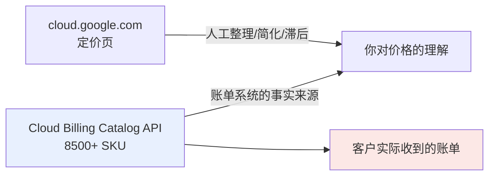

# 第 10 章 · 成本模型与选型

> **本章所有价格的核查日期:2026-08-15。** 数据来源不是官网定价页,而是 Cloud Billing Catalog API——也就是 GCP 账单系统自己用的那份 SKU 目录。价格会变,复现方法不会变,所以本章的重点是**方法**,表格只是那一天跑出来的快照。

## 10.1 这一步要解决什么问题

前面九章回答的都是同一类问题:**这东西怎么搭起来**。但把 agent 跑通,只是 FDE 工作的上半场。

真实的 discovery 会议上,客户听完你的方案演示,接下来问的三个问题几乎是固定的:

1. **"这套东西一个月多少钱?"**
2. **"为什么用 Gemini 不用别的?为什么用 Flash 不用 Pro?"**
3. **"如果我们的量涨十倍,成本是线性涨还是指数涨?"**

这三个问题,前九章一个都答不了。而它们恰恰是决定项目能不能从 PoC 走到生产的关键——技术可行性通常不是卡点,**预算和采购流程才是**。一个能跑的 demo 加上一份站得住脚的成本模型,才构成一个完整的交付物;只有前者,客户内部推不动。

更麻烦的是,这三个问题**不能靠翻定价页现场回答**。原因有三:

**第一,官网定价页是"营销视图",不是"账单视图"。** 定价页为了可读性,会把 SKU 做大量合并和简化,只展示最主流的那几档。而客户的账单上会出现定价页上根本没有的条目——不同服务档位、不同区域、长上下文阶梯、缓存存储费,这些在定价页上要么被折叠,要么被脚注一笔带过。

**第二,模型迭代速度远快于文档更新速度。** 本手册前九章成文时用的是 Gemini 2.5 Flash,而截至 2026-08-15,`gemini-3.7-flash` / `3.6` / `3.5` 已经全部 GA。定价页上的表格常常滞后于实际可用的模型。

**第三,"报错的价格"和"报错的代码"一样致命,但更难发现。** 代码写错了会立刻抛异常,价格算错了要等到客户收到第一张账单才会暴露——那时候信任已经损失了。

!!! warning "本章的写作原则"
    价格是**会过期的事实**。本章不追求"给你一张永远正确的价格表"——那不可能——而是给你一个**每次客户会议前十分钟就能重跑一遍的取数流程**。表格里的每个数字都标注了核查日期,凡是当天没能验证的位置,一律留空并标注 ⬜,不用估算值填充。

## 10.2 在 GCP 上具体怎么做:直接问账单系统要价

### 为什么是 Cloud Billing Catalog API

GCP 有一个公开的 API,直接暴露账单系统内部使用的 SKU 目录:每个 SKU 的描述、计价单位、分档费率、适用区域。这就是你账单上那些条目的来源。



关键点在于右下角那条线:**账单是从 SKU 目录生成的,不是从定价页生成的**。所以当定价页和 SKU 目录不一致时,客户账单上出现的一定是 SKU 目录里的那个数。直接读 SKU 目录,等于跳过了中间的人工整理环节。

### 前置准备

这个 API 不需要开启任何额外服务,用现有的 ADC 凭证就能读:

```bash
# 确认当前身份可用
gcloud auth application-default print-access-token > /dev/null && echo "ADC OK"
```

需要知道的只有一件事:**服务 ID**。GCP 把 SKU 按"服务"分组,每个服务有一个形如 `C7E2-9256-1C43` 的 ID。这个 ID 不能猜,必须从服务列表里查——而服务列表有一千七百多条,必须翻页。

## 10.3 核心代码

完整代码(`billing_catalog.py`):

```python
"""从 Cloud Billing Catalog API 拉取真实 SKU 价格。

用法:
    python billing_catalog.py "Gemini 3.7 Flash.*Text"
"""
import json
import re
import subprocess
import sys
import urllib.request

BASE = "https://cloudbilling.googleapis.com/v1"


def _token() -> str:
    return subprocess.check_output(
        ["gcloud", "auth", "print-access-token"], text=True
    ).strip()


def _get(url: str, token: str) -> dict:
    req = urllib.request.Request(url, headers={"Authorization": f"Bearer {token}"})
    return json.load(urllib.request.urlopen(req))


def find_services(keyword: str) -> list[tuple[str, str]]:
    """服务列表有 1700+ 条,必须翻页翻到底,否则会漏。"""
    token, url, hits = _token(), f"{BASE}/services?pageSize=500", []
    while url:
        r = _get(url, token)
        for s in r.get("services", []):
            if keyword.lower() in s.get("displayName", "").lower():
                hits.append((s["serviceId"], s["displayName"]))
        nxt = r.get("nextPageToken")
        url = f"{BASE}/services?pageSize=500&pageToken={nxt}" if nxt else None
    return hits


def list_skus(service_id: str) -> list[dict]:
    token, url, out = _token(), f"{BASE}/services/{service_id}/skus?pageSize=5000", []
    while url:
        r = _get(url, token)
        out += r.get("skus", [])
        nxt = r.get("nextPageToken")
        url = (f"{BASE}/services/{service_id}/skus?pageSize=5000&pageToken={nxt}"
               if nxt else None)
    return out


def unit_price(sku: dict) -> tuple[float | None, str | None]:
    """取最后一档费率。Gemini 的 token SKU 通常只有一档。"""
    try:
        expr = sku["pricingInfo"][0]["pricingExpression"]
        rate = expr["tieredRates"][-1]["unitPrice"]
        value = int(rate.get("units", 0)) + rate.get("nanos", 0) / 1e9
        return value, expr["usageUnit"]
    except (KeyError, IndexError):
        return None, None


def report(service_id: str, pattern: str) -> None:
    rows = set()
    for sku in list_skus(service_id):
        desc = " ".join(sku["description"].split())   # SKU 描述里有不规则空格
        if not re.search(pattern, desc, re.I):
            continue
        value, unit = unit_price(sku)
        if value is None or value == 0 or unit != "count":
            continue
        rows.add((desc, value * 1e6))                 # count → 每 1M tokens
    for desc, price in sorted(rows):
        print(f"{desc:<72} {price:>10.3f}")


if __name__ == "__main__":
    print(find_services("Vertex AI"))
    report("C7E2-9256-1C43", sys.argv[1] if len(sys.argv) > 1 else "Gemini")
```

逐个函数说明。

### `find_services`:为什么必须翻页

```python
while url:
    r = _get(url, token)
    ...
    nxt = r.get("nextPageToken")
    url = f"{BASE}/services?pageSize=500&pageToken={nxt}" if nxt else None
```

这是本章第一个坑。GCP 的服务总数是 **1777 个**(2026-08-15 实测),而 `pageSize` 就算设到上限,单页也拿不全。第一次写这段代码时只请求了一页就去过滤关键词,结果匹配到的是 `Magento on Ubuntu 16.04 LTS`——一个完全无关的第三方 Marketplace 镜像,只因为它的描述里恰好带了 "Vertex AI" 字样。**翻页翻到底之后**才拿到真正要的这几个:

```text
C7E2-9256-1C43  Vertex AI
74B1-77CF-C302  Vertex AI Search
AEFD-7695-64FA  Gemini API
E5FE-878F-FECE  Vertex AI Vision
```

注意 `Vertex AI` 和 `Gemini API` 是**两个不同的 service**——这正好对应第 1 章讲的双通路(AI Studio API key vs Vertex ADC):两条路的账单是分开记的。给客户做 TCO 时,必须先确认他们走的是哪条路,否则查错了 service 就全盘皆错。

### `unit_price`:`units` + `nanos` 这个坑

```python
value = int(rate.get("units", 0)) + rate.get("nanos", 0) / 1e9
```

Google API 表示金额用的是 `units`(整数部分)+ `nanos`(十亿分之一)两个字段的组合,而不是浮点数——这是为了避免浮点精度问题。token 单价都非常小(比如 `$0.0000015`),整数部分是 0,全部信息都在 `nanos` 里。**只读 `units` 会得到全是 0 的价格表**,这个错误很隐蔽,因为代码不报错,只是结果全零。

### `usageUnit != "count"` 的过滤

SKU 里混着两种完全不同的计价单位:

| `usageUnit` | 含义 | 典型 SKU |
|---|---|---|
| `count` | 按 token 个数计费 | `Gemini 3.7 Flash Global Text Input - Predictions` |
| `h` | 按小时计费 | `Gemini 3.6 Flash Image Input Caching Storage` |
| `mo` | 按月计费 | `Vertex AI: Provisioned Throughput 1 month` |

不做这层过滤,会把"每小时 $0.000001 的缓存存储费"和"每 token $0.0000015 的推理费"混在一张表里比较,得出完全荒谬的结论。**缓存不是一次性费用,是持续计费的**——这一点在 10.6 节展开。

## 10.4 真实运行效果

以下是 2026-08-15 从 `C7E2-9256-1C43`(Vertex AI,共 **8524** 个 SKU)中拉出的实际数据,单位统一换算为 **$ / 1M tokens**。

### Gemini 3.7 Flash

| 档位 | Global 输入 | Global 输出 | Regional 输入 | Regional 输出 |
|---|---:|---:|---:|---:|
| **Priority** | 2.700 | 13.500 | 2.970 | 14.850 |
| **Standard** | 1.500 | 7.500 | 1.650 | 8.250 |
| **Flex** | 0.750 | 3.750 | 0.825 | 4.125 |
| **Batch** | 0.750 | 3.750 | 0.825 | 4.125 |

### Gemini 3.0 / 3.1 Pro

| 档位 | 输入 | 输出 | 输入(Long) | 输出(Long) |
|---|---:|---:|---:|---:|
| **Priority** | 3.600 | 21.600 | 7.200 | 32.400 |
| **Standard** | 2.000 | 12.000 | 4.000 | 18.000 |
| **Flex** | 1.000 | 6.000 | 2.000 | 9.000 |
| **Batch** | 1.000 | 6.000 | 2.000 | 9.000 |

### Live API(语音)

| 模型 | 音频输入 | 音频输出 | 文本输入 | 文本输出 |
|---|---:|---:|---:|---:|
| `Gemini 2.5 Flash Live` | 3.000 | 12.000 | 0.500 | 2.000 |
| `Gemini 3.1 Flash Live` | 3.000 | 12.000 | ⬜ | ⬜ |
| `Gemini 2.0 Flash Live` | 3.000 | 12.000 | 0.500 | 2.000 |

### Provisioned Throughput(每 GSU)

| 承诺期 | Vertex AI(global) | Agent Platform(non-global) |
|---|---:|---:|
| 1 week | — | $7.854 / h |
| 1 month | $2,700 / mo | $2,970 / mo |
| 3 month | $2,400 / mo | — |
| 1 year | — | $2,200 / mo |

## 10.5 定价结构里的五个坑

这五条是从上面的原始数据里读出来的**结构**,不是某个具体数字——数字会过期,结构通常不会。

### 坑 1:服务档位是一个独立的价格维度

大多数人以为选完模型价格就定了。实际上同一个模型有**四档服务等级**,价格差 3.6 倍:

```text
Priority  =  Standard × 1.8     ← 优先容量,排队更短
Standard  =  基准
Flex      =  Standard × 0.5     ← 可被抢占,延迟无保证
Batch     =  Standard × 0.5     ← 异步批处理
```

这个比例在 3.7 Flash 和 3.0/3.1 Pro 上**完全一致**(`2.70/1.50 = 1.8`,`13.50/7.50 = 1.8`,`0.75/1.50 = 0.5`),说明它是平台级的定价策略,不是单个模型的特例。

对 FDE 的实际意义:客户说"太贵了",第一反应不该是换小模型(会掉质量),而是先问**这部分流量是不是真的需要 Standard 档**。离线的文档处理、夜间的批量总结、评估流水线——这些跑 Batch 或 Flex 立刻省一半,质量完全不变。

!!! tip "Flex 和 Batch 同价,但不同用"
    两者价格完全一样(都是 Standard 的 50%),区别在于:**Batch 是异步作业**(提交任务、稍后取结果),**Flex 是同步调用但容量可被抢占**(延迟无 SLA,高峰期可能排队更久)。需要立刻拿到结果但不在乎慢一点的场景选 Flex,完全离线的场景选 Batch。

### 坑 2:Global 和 Regional 差 10%

```text
Regional = Global × 1.10
```

3.7 Flash 的输入 `1.650 / 1.500 = 1.10`,输出 `8.250 / 7.500 = 1.10`。而且这个 10% 溢价**同样适用于 Provisioned Throughput**:`$2,970 / $2,700 = 1.10`,`$7.854 / $7.14 = 1.10`。

这条极其重要,因为它把**成本和数据驻留直接挂上了钩**:客户要求数据留在某个特定区域,代价不只是"可用模型变少"(见第 11 章),还有一笔明确的 **10% 溢价**。这个数字可以直接写进给客户的 TCO 表格里,作为"合规成本"单列一行——比笼统地说"合规会增加成本"有说服力得多。

### 坑 3:长上下文是阶梯价,而且输入输出涨幅不同

Pro 的 `(Long)` SKU:

```text
输入:  $2.00  →  $4.00     (2.0×)
输出:  $12.00 →  $18.00    (1.5×)
```

"把 1M 上下文窗口塞满"不是免费的。更容易被忽略的是**输出也涨价**——很多人只知道输入有阶梯,把输出按基准价算进 TCO,长文档场景会低估三分之一。

!!! warning "阈值本身需要单独确认"
    SKU 描述里只有 `(Long)` 这个标记,**没有写明阈值是多少 token**。这个阈值是模型相关的,需要查对应模型的文档确认。本次核查未取到该数值,标记为 ⬜——不用记忆中的"200k"填充,因为不同模型代次可能不同。

### 坑 4:Thinking token 有独立 SKU

目录里存在这样一组 SKU:

```text
Gemini 2.5 Flash Text Output - Predictions                     0.600
Gemini 2.5 Flash Text Output (Thinking On) - Predictions       3.500
```

同一个模型,开不开 thinking 走的是**不同的 SKU**。而在另一个 SKU 家族(描述里带 `GA`)里,两者又是同价的(都是 2.500)。

这意味着两件事:

1. **Thinking token 按输出计费**,不是免费的"内部过程"。
2. **哪个 SKU 家族对应你的流量,必须从实际账单导出里确认**,不能从模型名推断。

下面是本手册环境里的一次实测(`gemini-2.5-flash`,2026-08-15):

```text
prompt: "Reply with exactly: vertex ok"

prompt_token_count      = 6
candidates_token_count  = 2      ← 用户看得见的输出
thoughts_token_count    = 21     ← 用户看不见,但计费
total_token_count       = 29
traffic_type            = ON_DEMAND
```

**可见输出 2 个 token,实际按输出计费的是 23 个。** 一个只要求回答两个词的请求,thinking 烧掉了十倍于答案的 token。任何没有把 `thoughts_token_count` 计入的 TCO 模型,在推理密集场景下会系统性低估——而且低估的幅度取决于任务难度,不是一个固定系数。

!!! note "怎么在代码里关掉"
    ```python
    from google.genai import types

    config = types.GenerateContentConfig(
        thinking_config=types.ThinkingConfig(thinking_budget=0)
    )
    ```
    但请注意:**关掉 thinking 会影响质量**,这是一个 quadrilemma 取舍(成本 ↓ / 质量 ↓),不是免费优化。正确做法是按任务分层——路由、分类、格式化这类确定性任务关掉,需要推理的任务留着。

### 坑 5:上下文缓存是按小时持续计费的

```text
Gemini 3.6 Flash Image Input Caching Storage    $0.000001 / h
```

注意单位是 `/h`,不是 `/count`。**缓存不是"付一次省很多次",而是"每小时持续付租金"**。这意味着缓存有一个明确的回本条件:

```text
命中节省的总额  >  缓存内容 token 数 × 存储单价 × 缓存存活小时数
```

高频复用的大文档(比如每天被查询上千次的产品手册)显然划算;而"存了一份大文档,一天只查两次"是净亏损。这个计算必须在建缓存前做,不能建完再说。

## 10.6 真实踩过的坑

**1. 服务列表不翻页 → 匹配到无关的 Marketplace 镜像。** 前面已经详述。教训是:GCP 的列表类 API 几乎都分页,`pageSize` 设大不等于能一次拿全,**永远处理 `nextPageToken`**。

**2. `nanos` 字段被忽略 → 整张价格表全是 0。** 这个错误最阴险,因为代码正常退出、表格正常输出,只是所有数字都是 0。如果没有"token 单价不可能是 0"这个常识做交叉验证,很容易直接把这张全零表拿去用。

**3. 官方文档站 301 到了新域名。** 核查过程中,`cloud.google.com/vertex-ai/generative-ai/docs/learn/locations` 返回 `301 Moved Permanently`,指向 `docs.cloud.google.com/...`。同时 VPC-SC 文档里的内部链接已经改成了 `/gemini-enterprise-agent-platform/` 路径——**第 0 章讲的改名,已经落到 URL 层面了**。老书签会 404,这不是你的环境问题。

**4. 定价页抓不全。** 尝试用自动化方式解析官网定价页时,页面因为过长被截断,拿不到完整表格。这反过来印证了走 Billing Catalog API 的必要性:**结构化 API 比给人看的网页可靠**。

**5. 同一个模型有多个 SKU 家族,描述里的空格还不规则。** 目录里同时存在 `Gemini 2.5 Flash ...`、`Gemini 2.5 Flash GA ...`、`Gemini 2.5 Flash Ga ...`(注意大小写不一致),还有些描述前面带一个多余空格。代码里那句 `" ".join(sku["description"].split())` 就是为了处理这个——**不做归一化,去重和匹配都会出错**。

## 10.7 优化方向

**把取数变成会前例行动作。** 上面的脚本跑一次约十几秒。建议在每次客户定价讨论前重跑,把输出连同日期一起存档。价格变动本身就是有价值的情报——如果某个模型的 SKU 悄悄涨了或多了一档,你会是第一个知道的。

**用真实账单校准,而不是只靠目录价。** Billing Catalog 给的是**列表价**。客户如果有 committed use discount、企业协议折扣或者 Marketplace 私有报价,实际账单会低于列表价。正确的做法是:用目录价建模型算**上限**,再用客户实际账单导出(BigQuery billing export)校准出**实际系数**。给客户的第一版 TCO 用列表价是诚实的,但要明确标注"未含任何企业折扣"。

**把 GSU 换算补上。** Provisioned Throughput 的价格拿到了(每 GSU 每月 $2,700 起),但 **"1 GSU 对应多少 token/秒"这个换算系数本次没有取到**,标记 ⬜。没有这个系数,就无法计算"按量转 PT 的盈亏平衡点"——而这恰恰是所有高并发客户都会问的问题。这是本章最大的缺口,需要从模型专属文档补齐。

**把成本模型和第 7 章的评估打通。** 单看成本没有意义,成本必须和质量一起看。理想的产出是一张**成本-质量曲线**:横轴是 $/1000 次请求,纵轴是第 7 章的评估得分,每个模型/档位组合是一个点。有了这张图,"为什么选 Flash 不选 Pro"就不再是一句主观判断,而是一个可以指着看的取舍点。

**区分一次性成本和边际成本。** 本章讨论的全是边际成本(每 token)。完整的 TCO 还要包含:开发人力、Cloud Run/Agent Runtime 的常驻费用、日志和 trace 的存储费、以及第 11 章会讲的合规相关成本。客户问"一个月多少钱"时,只报 token 费用是不完整的,而不完整的报价在采购环节会被当成不专业。
