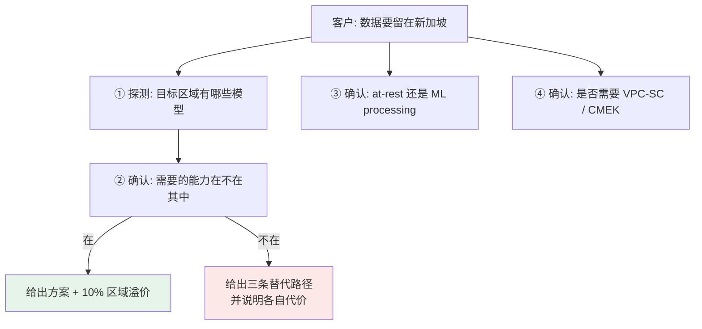

# 第 11 章 · 企业边界与数据驻留

> **核查日期:2026-08-15。** 本章的区域可用性数据是在一个真实 GCP 项目上跑脚本实测的,不是抄文档。合规类结论会随产品覆盖变化而变化,**每次客户会议前都应该重跑一遍探测脚本**。

## 11.1 这一步要解决什么问题

第 4 章做了护栏,但那是**内容安全**——防止 agent 说错话。本章讲的是另一个完全不同的维度:**基础设施边界**——数据在哪里、谁能碰、跑在什么容量上。

这两件事经常被混为一谈,但在客户那边是两个部门在管。内容安全归风控/法务,基础设施边界归**安全架构团队**,而后者才是能一票否决整个项目的人。

一个典型的场景:demo 演示得很成功,业务方很满意,然后安全架构师进来问了五个问题:

1. **"数据出境吗?我们的监管要求数据留在本地。"**
2. **"你们的服务能不能放进我们的 VPC Service Controls 边界里?"**
3. **"模型处理的数据用你们的密钥加密还是我们的?"**
4. **"高峰期你们保证多少吞吐?超了会不会被限流?"**
5. **"这个 agent 用的是哪个身份?出了事怎么审计?"**

这五个问题一个都答不上来,项目就停在这里。而它们**没有一个能靠"我回去查一下文档"糊弄过去**——安全架构师会当场追问细节,含糊的回答比说"我不知道,我明天给你准确答案"更伤信任。

!!! warning "本章最重要的一条:数据驻留有两个独立的承诺,不是一个"
    "数据留在新加坡"这句话,在 GCP 语境里至少拆成两件事:**静态数据驻留**(data at rest——存储的数据落在哪个区域)和 **ML 处理驻留**(ML processing——推理计算发生在哪个区域)。这两件事的区域覆盖**不一样**,承诺条款也不一样。客户说"数据不出境"时,你必须先问清楚他要的是哪一种,或者两种都要。把它们当成一件事回答,是这道题最常见的翻车方式。

## 11.2 在 GCP 上具体怎么做:先测,再答

安全问题的答案不能靠记忆,因为**产品的区域覆盖每个季度都在变**。唯一可靠的做法是在客户的目标区域上跑一次探测。



第 ① 步是唯一能自动化的,也是最有说服力的——**你带着实测数据进会议,而不是带着"我记得好像"**。

## 11.3 核心代码

完整代码(`region_probe.py`):

```python
"""探测指定区域上实际可用的模型,用于回答客户的数据驻留问题。

用法:
    python region_probe.py asia-southeast1 us-central1 global
"""
import os
import sys

from google import genai

PROJECT = os.environ["GOOGLE_CLOUD_PROJECT"]

# 客户最常问的几类能力,按关键词归类
CAPABILITIES = {
    "live (语音 S2S)": ("live",),
    "native audio": ("native-audio",),
    "TTS": ("tts",),
    "embedding": ("embedding", "gecko"),
}


def probe(location: str) -> dict:
    client = genai.Client(vertexai=True, project=PROJECT, location=location)
    try:
        names = [m.name.split("/")[-1] for m in client.models.list()]
    except Exception as exc:                      # 区域不支持时会直接抛错
        return {"error": f"{type(exc).__name__}: {exc}"}

    return {
        "total": len(names),
        "gemini": sorted(n for n in names if n.startswith("gemini")),
        "caps": {
            label: sorted(n for n in names if any(k in n for k in keys))
            for label, keys in CAPABILITIES.items()
        },
    }


if __name__ == "__main__":
    for loc in sys.argv[1:]:
        r = probe(loc)
        print(f"\n{'=' * 60}\n{loc}\n{'=' * 60}")
        if "error" in r:
            print(f"  ✗ {r['error']}")
            continue
        print(f"  模型总数: {r['total']}    Gemini: {len(r['gemini'])}")
        for label, hits in r["caps"].items():
            print(f"  {label:<18} {hits if hits else '✗ 不可用'}")
```

### 为什么必须 `list` 而不是直接调用

一个很自然的写法是"直接拿模型 ID 调一次,看报不报错"。这样做有两个问题:

1. **会花钱**。探测五个区域 × 三个模型就是十五次真实推理调用。
2. **报错信息会误导**。模型在该区域不存在时,返回的可能是 `404`,也可能是 `403`(权限)或 `400`(参数无效),取决于具体是哪一层拦下来的。你会花时间去排查一个根本不存在的权限问题。

`models.list()` 是**只读、免费、且语义明确**的:返回什么就是有什么。第 1 章讲的"永远先 list 再调用"原则,在合规探测这个场景下的收益更大。

### `try/except` 包住整个 `list`

有些区域**根本不提供 Vertex AI 端点**,这时候连 `list` 都会抛异常,而不是返回空列表。不包 `try` 的话脚本会在第一个不支持的区域直接崩掉,拿不到后面区域的数据。

## 11.4 真实运行效果

2026-08-15,在项目 `adk-fde-lab` 上实测:

| 区域 | 模型总数 | Gemini 数 | Live | TTS |
|---|---:|---:|:---:|:---:|
| `us-central1` | 127 | 26 | ✅ | ✅ |
| `global` | 23 | 23 | ✅ | ✅ |
| `asia-northeast1`(东京) | 7 | ⬜ | ❌ | ❌ |
| **`asia-southeast1`(新加坡)** | **9** | **1** | ❌ | ❌ |

`asia-southeast1` 上可用的全部 9 个模型:

```text
gemini-2.5-flash                    ← 唯一的 Gemini
gemma3
gemma4
textembedding-gecko
text-embedding-005
text-multilingual-embedding-002
multimodalembedding
imagetext
image-segmentation-001
```

**没有 Pro。没有 3.x 全系。没有 Live API。没有 TTS。**

### 这个结果直接改写了三个常见回答

**① "新加坡能做语音 agent 吗?"**

不能——如果"数据不出境"包含 ML 处理。Live API 在 `asia-southeast1` **不存在**,这是产品覆盖事实,不是配置问题,不是配额问题,也不是申请就能开通的东西。

三条替代路径,以及各自的代价:

| 路径 | 做法 | 代价 |
|---|---|---|
| A · 接受跨区处理 | 推理走 `us-central1`,静态数据仍存新加坡 | 需要客户法务确认 ML 处理出境可接受;延迟增加一个跨太平洋 RTT |
| B · 自建级联 | ASR / TTS 用能落新加坡的方案,只把 LLM 那段交给 `gemini-2.5-flash`(新加坡有) | 系统复杂度显著上升,要自己维护 ASR/TTS;但换来了可控性 |
| C · 等区域上线 | — | 不可控;不要给客户任何时间承诺 |

**② "那我们用 global endpoint 不就好了?"**

这是这道题的**陷阱选项**。`global` 上有 23 个 Gemini 模型,能力最全,看起来完美——但 global endpoint 的本质是"由 Google 调度到全球任意可用容量",它**不对数据处理位置做任何区域承诺**。客户如果是因为监管要求才提数据驻留,global 恰恰是最不能选的那个。

能力最全的选项和合规要求最冲突——这个反直觉的结论,是本章最值得记住的一句话。

**③ "合规会增加多少成本?"**

有确切数字。第 10 章从账单目录里读出的结构:

```text
Regional = Global × 1.10
```

**区域化部署有明确的 10% 溢价**,而且这个溢价同样适用于 Provisioned Throughput(`$2,970 / $2,700 = 1.10`)。这可以作为"合规成本"在 TCO 表里单列一行,比笼统说"合规更贵"专业得多。

!!! warning "at-rest 与 ML processing 的具体承诺条款,本次未取到"
    本次核查中,官方 locations 文档发生了 `301` 跳转到新域名,自动抓取未能拿到承诺条款的**原文措辞**,因此本章不引用任何具体条款文字,标记 ⬜。
    这不是可以"凭印象补上"的东西——**给客户的合规回答必须能引用到原文**,否则一旦客户法务追问出处,你无法自证。正确做法:每次客户会前,人工打开当前的官方 locations 页面,把与该客户目标区域相关的那几句原文**复制存档并标注日期**。这类结论的保质期很短。

## 11.5 边界的另外三层:VPC-SC、CMEK、身份

区域只解决了"数据在哪",还有三个问题:谁能把数据带出去、数据用谁的密钥加密、以及是谁在调用。

### VPC Service Controls

VPC-SC 是**在 IAM 之上再加一层网络边界**:即使某个身份的 IAM 权限是合法的,只要它在边界外,请求依然会被拒。它防的是"凭证泄露后数据被批量搬走"这类场景——这正是银行安全团队最担心的事。

2026-08-15 核查官方支持列表:

| 服务 | VPC-SC 支持 | 已知限制 |
|---|---|---|
| `aiplatform.googleapis.com` | ✅ GA | 有产品侧的专门限制清单,需单独查阅 |
| `storage.googleapis.com` | ✅ GA | — |
| `bigquery.googleapis.com` | ✅ GA | BigQuery **作业必须在边界内的项目里运行**,或由 egress 规则显式放行 |
| `dlp.googleapis.com` | ✅ GA | VPC-SC 目前**不支持文件夹和组织级资源**,涉及组织级 DLP 资源时会有问题 |

注意最后一行:第 4 章用到的 DLP 虽然支持 VPC-SC,但**组织级资源不在保护范围内**。如果客户的 DLP 模板建在组织层级(大企业的常见做法,为了跨项目复用),这层保护会有缺口——这是一个需要主动向客户说明的细节,而不是等他们自己发现。

!!! note "个人账号做不了 VPC-SC 实操"
    VPC Service Controls 需要 Organization 资源,个人 GCP 账号没有 Organization,因此**无法在沙箱里实操验证**。这是账号类型的限制,不是能力问题。本章因此只提供官方支持矩阵,不提供实操记录——**如实标注做不到的部分,是这份手册的写作原则**。真正的实操验证要等接触到有组织结构的客户环境。

### CMEK(客户自管密钥)

默认情况下,GCP 用 Google 管理的密钥加密静态数据。CMEK 允许客户用自己在 Cloud KMS 里的密钥,关键差别在于:**客户可以单方面吊销密钥,让数据立刻不可读**——这是很多金融客户合规清单上的硬性条目,因为它把"删除数据"的最终控制权交回给了客户。

本次未在沙箱中实操验证 Vertex AI 侧 CMEK 的具体配置方式和覆盖范围,标记 ⬜。

### 身份:agent 在生产环境用的是谁

第 1 章已经讲了 ADC 的三层查找顺序,这里补上它的**安全含义**:

```text
1. $GOOGLE_APPLICATION_CREDENTIALS  → 磁盘上的 SA key 文件
2. gcloud 的 ADC 文件               → 开发者个人身份
3. metadata server                  → 运行环境挂载的 service account
```

给客户的标准建议是**第 3 层**,理由要说清楚:

- **第 1 层**意味着磁盘上躺着一个长期有效的凭证文件。它会被 `git commit`、会被打进容器镜像、会被复制到笔记本上。这是安全评审里最常被挑的一条。
- **第 2 层**用的是开发者个人身份。第 1 章 dump 出的 `client_id`(`764086051850-...`)是 **gcloud CLI 的公共 OAuth client,全世界所有 gcloud 用户共用同一个**——所以它必须额外携带 `quota_project_id` 来指明账单归属。用个人身份跑生产,人一离职权限就断,审计日志里也只能看到"某个人"而不是"某个服务"。
- **第 3 层**没有任何长期凭证落盘,令牌由 metadata server 短期签发并自动轮换。第 6 章部署到 Agent Runtime 之后,走的就是这一层。

## 11.6 容量:Provisioned Throughput 与配额

### 怎么证明当前走的是哪条

不需要查控制台,响应元数据里直接带着:

```python
resp = client.models.generate_content(model="gemini-2.5-flash", contents="...")
print(resp.usage_metadata.traffic_type)
# → TrafficType.ON_DEMAND
```

实测输出 `ON_DEMAND`,说明当前是按量计费。买了 Provisioned Throughput 之后这个字段会变化——**这给了你一个客户现场可验证的手段**:客户说"我们买了 PT,但感觉没生效",不用猜,打印这个字段就知道流量实际落在哪条上。

### PT 的价格阶梯

来自第 10 章的账单目录数据(每 GSU):

| 承诺期 | Vertex AI(global) | Agent Platform(non-global) |
|---|---:|---:|
| 1 week | — | $7.854 / h |
| 1 month | $2,700 / mo | $2,970 / mo |
| 3 month | $2,400 / mo | — |
| 1 year | — | $2,200 / mo |

承诺越长单价越低,这是标准的容量承诺折扣曲线。1 年相比 1 个月省约 19%。

!!! warning "盈亏平衡点算不出来,缺一个系数"
    要回答"我们该不该从按量转 PT",需要知道 **1 GSU 等于多少 token/秒**。这个换算系数是模型相关的,本次核查未取到,标记 ⬜。
    没有它,只能告诉客户"PT 起步价是每月 $2,700 一个 GSU",无法算出临界流量。这是本章和第 10 章共同的最大缺口,**在真正给客户做 PT 建议之前必须补齐**。

### 配额是按"模型 × 区域范围"分桶的

实测项目上的配额指标名:

```text
aiplatform.googleapis.com/online_prediction_requests_per_base_model
aiplatform.googleapis.com/global_online_prediction_requests_per_base_model
aiplatform.googleapis.com/us_multi_region_online_prediction_requests_per_base_model
aiplatform.googleapis.com/eu_multi_region_online_prediction_requests_per_base_model
aiplatform.googleapis.com/long_running_online_prediction_requests_per_base_model
```

从命名可以读出两条结构性事实:

1. **配额是 per base model 的**,不是整个项目一个总额。换一个模型 ID,用的是另一个配额桶。
2. **区域范围各有独立配额**:regional / global / us-multi-region / eu-multi-region 是**四个互不相通的桶**。

第 2 条有个直接的实用推论:客户在某个区域被限流时,**切到 global endpoint 是一条真实的泄压路径**,因为那是另一个配额桶——但代价是失去区域承诺(见 11.4 的陷阱选项)。这个取舍要讲清楚,不能只讲好处。

## 11.7 真实踩过的坑

**1. 把"区域有这个 API"当成"区域有这个模型"。** `aiplatform.googleapis.com` 在 `asia-southeast1` 是可用的,控制台也能打开,一切看起来正常——直到你用一个该区域不存在的模型 ID 发起调用。API 可用性和模型可用性是两个维度,**必须分别验证**。

**2. 用 `global` 做"区域可用性"的对照组,得出错误结论。** `global` 有 23 个 Gemini,`us-central1` 有 26 个,看起来差不多。但 `global` 的 127 vs 23 的总数差距说明两者的模型构成完全不同——`global` 只有 Gemini 系,没有 embedding/imagen/veo 这些。拿 `global` 当"标准区域"去推断别的区域,会得出错的基线。

**3. 探测脚本不包 `try` 直接崩。** 已在 11.3 说明。

**4. 假设文档 URL 稳定。** 本次核查中官方文档站发生 `301` 跳转,且内部链接路径已改为 `/gemini-enterprise-agent-platform/`。**改名已经落到 URL 层面**(见第 0 章)。给客户发文档链接前先自己点一遍,发出去的 404 链接很伤专业形象。

**5. 把内容安全当成企业安全交付。** 第 4 章的 Model Armor 做完之后,很容易产生"安全这块做完了"的错觉。实际上安全架构师关心的五个问题里,Model Armor 一个都没回答。**这两层要分开讲、分开验收。**

## 11.8 客户 Q&A 速查

以下是可以直接带进会议的答案骨架。**每一条都必须在会前用 11.3 的脚本重新验证**,因为区域覆盖会变。

**Q:数据会留在我们国家吗?**
A:先反问是 at-rest 还是 ML processing——这是两个独立承诺,覆盖范围不同。确认之后,我用探测脚本给你目标区域上实际可用的模型清单,以及为此要放弃哪些能力。

**Q:我们要在新加坡做语音 agent,数据不出境。**
A:今天做不到。Live API 在 `asia-southeast1` 不提供(实测 2026-08-15,该区域仅 9 个模型、1 个 Gemini)。三条路:接受 ML 处理跨区、自建级联把 ASR/TTS 留在本地、或等区域上线——我不会给你第三条的时间表。

**Q:用 global endpoint 行不行?**
A:能力最全,但它不对处理位置做区域承诺。如果你的驻留要求来自监管,global 恰恰是不能选的那个。

**Q:合规要多花多少钱?**
A:区域化部署有明确的 10% 溢价(账单目录实测,按量和 PT 都适用)。这是可以直接写进 TCO 的一行。

**Q:能放进我们的 VPC-SC 边界吗?**
A:`aiplatform.googleapis.com` 是 GA 支持的。但要提醒两点:BigQuery 作业必须在边界内运行;VPC-SC 目前不覆盖文件夹/组织级资源,如果你们的 DLP 模板建在组织层会有缺口。

**Q:agent 在生产用什么身份?**
A:挂载 service account,走 metadata server,没有任何密钥文件落盘,令牌自动轮换。不用 SA key 文件,也不用个人凭证。

**Q:高峰期吞吐有保证吗?**
A:默认按量,配额是按"模型 × 区域范围"分桶的。要保证吞吐就上 Provisioned Throughput,起步价每 GSU 每月 $2,700(1 年承诺可降到 $2,200)。具体买几个 GSU 需要你的峰值 QPS——这个换算我需要按你的模型单独确认。

**Q:怎么证明我们买的 PT 生效了?**
A:打印响应里的 `usage_metadata.traffic_type`,按量是 `ON_DEMAND`。不用猜,一行代码就能验。
