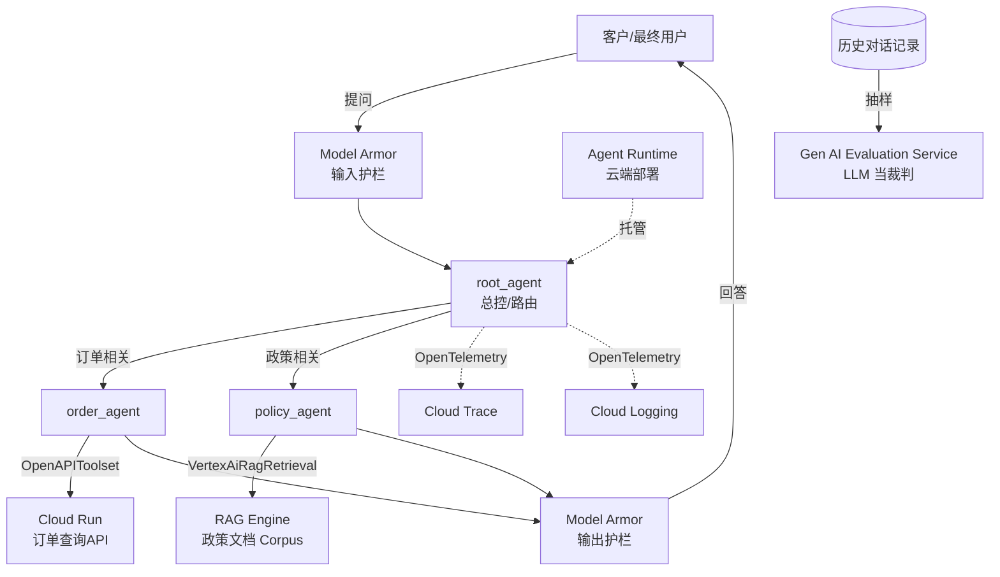

# 第 0 章 · Overview

## 这是什么

这是一份**端到端实战记录**：用 Google 的 [ADK（Agent Development Kit）](https://google.github.io/adk-docs/) 在 Google Cloud（现已改名 **Gemini Enterprise Agent Platform**，原 Vertex AI）上，从零搭出一个具备完整生产要素的客服 agent —— 工具调用、RAG 检索、安全护栏、全链路追踪、云端部署、LLM 自动评估,一个不少。

写这份手册的初衷,是为即将从事 **Forward Deployment Engineer（FDE）** 工作的人准备的上手教材——FDE 的日常就是"接到客户需求,用平台能力快速拼出一个能跑的东西",这份手册里的每一步、每一个坑,都是真实踩出来的,不是照着官方文档抄的示例。

## 场景设定

你是被派驻到 **Acme 零售** 的 FDE,客户想要一个 AI 客服 agent,需求是:

1. **查询订单状态**,对接客户现有的订单系统(REST API)
2. **回答退换货/配送政策问题**,基于客户提供的政策文档
3. **不能泄露隐私信息、不能讨论竞品**,需要有安全护栏
4. **每次对话可追溯审计**,方便出问题时排查
5. **部署上线**,给客户一个能直接调用的服务
6. **定期自动质检**,监控回答质量有没有随时间劣化

## 整体架构



**关键设计决策**:`root_agent` 自己不带任何工具,只负责判断用户意图、分派给专职子 agent —— 这不是随便选的架构,而是因为 ADK 的 RAG 检索工具（`VertexAiRagRetrieval`）**不能和其他工具挂在同一个 agent 上**,必须拆成独立子 agent。这个限制会在第 3 章细讲。

## 技术栈全景

| 需求 | 用的 GCP / ADK 组件 | 章节 |
|---|---|---|
| Agent 开发框架 | ADK（Agent Development Kit） | 第 1、2 章 |
| 工具集成(客户 API) | `OpenAPIToolset` + Cloud Run | 第 2 章 |
| 知识检索(RAG) | Vertex AI RAG Engine(Serverless 模式) | 第 3 章 |
| 安全护栏 | Model Armor + Sensitive Data Protection(DLP) | 第 4 章 |
| 全链路追踪 | OpenTelemetry → Cloud Trace / Cloud Logging | 第 5 章 |
| 云端部署 | Agent Runtime(原 Agent Engine) | 第 6 章 |
| 质量评估 | Gen AI Evaluation Service(LLM-as-judge) | 第 7 章 |
| 底层模型 | Gemini 2.5 Flash(通过 Vertex AI) | 全程 |

## 2026 年的一个重要背景

2026 年 4 月 Google Cloud Next 大会上,**Vertex AI 整体改名为 "Gemini Enterprise Agent Platform"**(合并了 Agentspace)。底层 API、Python SDK(`google-cloud-aiplatform`)基本没变,只是文档 URL 和控制台入口换了地方,部分环境变量名也在过渡期(`GOOGLE_GENAI_USE_VERTEXAI` → `GOOGLE_GENAI_USE_ENTERPRISE`)。这份手册里凡是涉及到这个改名的地方都会标注清楚,免得你对着旧文档或者旧博客一头雾水。

## 最终成品

部署完成后,是一个能这样对话的 agent(这是真实的运行记录,不是编的示例):

```text
提问: 帮我查一下订单 1002 的状态,另外换货要付运费吗

[order_agent]: 您的订单 1002 状态是处理中，预计5天内送达。

关于换货是否需要支付运费的问题，我将帮您转接给负责政策咨询的同事。

[policy_agent]: 根据Acme零售换货政策，首次换货的往返运费由Acme承担；若非质量问题导致的二次换货，运费将由买家承担。
```

一句话里混着两个不同性质的问题,`root_agent` 能正确拆分、分别路由给 `order_agent` 和 `policy_agent`,而且 `order_agent` 查的是真实部署在 Cloud Run 上的订单系统,`policy_agent` 的回答是基于真实检索到的政策文档,不是模型瞎编的。

访问方式有三种,详见第 6 章:

1. GCP 控制台的 Playground(网页聊天框,不用写代码)
2. Python SDK(`vertexai.agent_engines`)
3. REST API(任何语言都能调)

## 怎么读这份手册

第 1～7 章按照实际搭建顺序排列,每章结构一致:

1. **这一步要解决什么问题**
2. **在 GCP 上具体怎么做**(包含真实踩过的坑和排查过程)
3. **核心代码**
4. **这个 GCP 组件还能做什么**(超出本项目用到的范围,介绍这个组件的其他能力)
5. **优化方向**(当前实现的局限,以及生产化还需要做什么)

如果你只想看某一块(比如只关心 RAG 怎么接),直接跳到对应章节即可,每章相对独立。第 8 章是全局性的优化清单和参考资料汇总。
