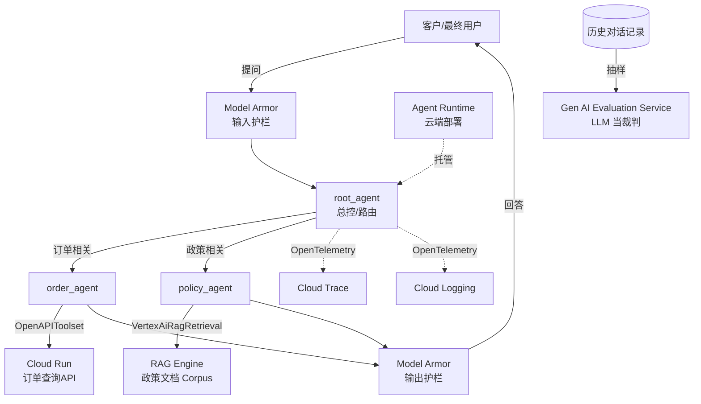

# 第 0 章 · Overview

## 这是什么

这是一份**端到端实战记录**：用 Google 的 [ADK（Agent Development Kit）](https://google.github.io/adk-docs/) 在 Google Cloud（现已改名 **Gemini Enterprise Agent Platform**，原 Vertex AI）上，从零搭出一个具备完整生产要素的客服 agent —— 工具调用、RAG 检索、安全护栏、全链路追踪、云端部署、LLM 自动评估,一个不少。

写这份手册的初衷,是为即将从事 **Forward Deployment Engineer（FDE）** 工作的人准备的上手教材——FDE 的日常就是"接到客户需求,用平台能力快速拼出一个能跑的东西",这份手册里的每一步、每一个坑,都是真实踩出来的,不是照着官方文档抄的示例。

在正式进入场景之前,有必要先说清楚两件事:FDE 到底是一份什么样的工作,以及为什么"接需求快速拼系统"这件事值得专门写一本手册来练——而不是等真正接到客户需求的那一天再现学。

## FDE 是一份什么样的工作

"Forward Deployed Engineer"这个头衔最早因 Palantir 大规模使用而被业界熟知,后来逐渐成为一类岗位的通称:公司把工程师直接派到客户现场(或者用远程协作的方式紧密绑定到某一个客户身上),不是坐在总部慢慢打磨自己团队维护多年的产品代码,而是拿着公司的平台/框架,对着客户的真实业务系统,现场"拼"出一个能跑起来的东西。今天大多数做企业级 AI 平台的云厂商都有对标这个头衔的岗位,叫法不完全一样(Solutions Engineer、Customer Engineer、Applied AI Engineer 等),但核心工作方式是相通的:你不生产平台本身,你生产"平台在某个具体客户身上落地之后的样子"。

### FDE 和"传统"工程师角色的几个本质不同

| 维度 | 传统后端/平台工程师 | FDE |
|---|---|---|
| 时间尺度 | 围绕一个系统深耕数月甚至数年 | 从需求澄清到能演示的原型,时间窗口经常以天甚至小时计 |
| 知识结构 | 深度优先,精通自己维护的那一套系统 | 广度优先,需要在"够用就好"和"用对组件"之间快速判断 |
| 工作环境 | 自己团队长期维护、熟悉每个历史决策的代码库 | 客户的 GCP 项目、客户的历史技术债、客户的组织策略约束——都是没法控制、但必须在里面工作的边界条件 |
| 调试的代价 | 出错通常只影响内部进度 | demo 卡在报错上,直接影响客户对这套技术方案、乃至对你个人的信心 |
| 产出形态 | 长期演进的产品代码 | 通常是原型/POC,验证可行性之后可能移交给客户自己的工程团队或者厂商的规模化交付团队 |

### 为什么这项能力需要刻意练习

"接到一个业务需求,快速判断该用平台的哪些组件拼出可运行系统"这件事,不是"多写点业务代码"就能自然而然掌握的能力,而是一项需要专门刻意练习的技能,原因有三:

1. **报错的模式识别需要重复积累,不能临场现学。** 这份手册里几乎每一章都至少踩到一个"文档没写清楚、CLI 报错语焉不详"的坑——第 1 章 IAM 绑定生效存在传播延迟、第 3 章新项目默认建库模式被容量白名单挡住、第 4 章 gcloud 报"权限拒绝"实际是 DLP 模板和 Model Armor 模板 region 不一致、第 5 章 OpenTelemetry 导出器包版本和 ADK 实际依赖的 variant 对不上。这些坑第一次踩到时都要花大量时间排查,但只要真的踩过一次、知道"看到这个报错关键词该往哪个方向查",下一次遇到同类问题就是几分钟的事——这正是刻意练习要解决的问题:把"排查未知报错"的时间成本提前一次性支付在低风险的练习项目里,而不是留到客户现场才第一次遇到。
2. **跨抽象层级跳转的调试直觉,教科书不教。** 第 4 章有个很典型的例子:`gcloud` CLI 报的错误信息含糊不清,换成直接调用底层 REST API 才拿到精确的报错原因。会不会在"看不懂报错"的时候本能地想到"往更底层看一层、换个更接近协议本身的工具去验证",是一种需要专门训练的调试直觉,不是背概念能获得的。
3. **"给定需求 → 该用哪套组件组合"的架构直觉,来自足够多的真实映射样本。** 这份手册第 2 章的工具类型选择表、第 3 章的 RAG 三方案对比表、第 6 章的部署目标对比,本质上都是在积累"某类需求 → 某个组件"的映射案例。见过的真实案例越多,现场面对客户的新需求时,越能快速在脑子里完成这种映射,而不是每次都从零翻文档。

!!! tip "这份手册的定位"
    与其说这是一份"ADK 使用说明书",不如说这是一份**刻意练习记录**——目的不是教会你 ADK 的每一个 API,而是让你在低风险环境里,完整走一遍 FDE 真实工作会经历的全部环节:需求拆解、架构选型、动手实现、真实报错、排查解决、部署上线、质量验证。走过一遍之后,遇到客户现场的新需求,你脑子里已经有一份可以直接拿来复用的"骨架"。

## 场景设定

你是被派驻到 **Acme 零售** 的 FDE,客户想要一个 AI 客服 agent,需求是:

1. **查询订单状态**,对接客户现有的订单系统(REST API)
2. **回答退换货/配送政策问题**,基于客户提供的政策文档
3. **不能泄露隐私信息、不能讨论竞品**,需要有安全护栏
4. **每次对话可追溯审计**,方便出问题时排查
5. **部署上线**,给客户一个能直接调用的服务
6. **定期自动质检**,监控回答质量有没有随时间劣化

这六条需求看起来是一份很普通的需求清单,但如果你留意会发现,它们分别对应着 GCP 上六个完全不同的产品能力——这正是 FDE 工作的常态:客户不会按"给我一个 ADK agent"这样的方式提需求,而是按业务语言提需求,翻译成"该用哪个组件"是你的工作,不是客户的工作。后面第 1～7 章就是按这份清单被满足的顺序,逐条把它们变成真实代码和真实部署。

## 整体架构



### 逐个拆解:图里的每个组件在做什么、数据往哪流

**主请求路径(实线,一次问答的完整往返):**

1. **User(客户/最终用户)** —— 对话的发起方。可以是 Acme 零售的终端消费者,通过网页聊天框、SDK 或者 REST API(第 6 章会讲这三种访问方式)发来一句自然语言提问。
2. **Guard1(Model Armor 输入护栏)** —— 请求进入 agent 业务逻辑之前的第一道关卡,检查用户输入里有没有敏感信息(PII)、有没有触发"不能讨论竞品"这类自定义规则(第 4 章)。它在数据流里位于 `root_agent` 之前,这个先后顺序不是随意的——护栏必须先于业务逻辑判断,而不是等 agent 处理完了再回头补救。
3. **Root(root_agent)** —— 整个系统唯一的入口 agent。它自己不挂任何工具,职责纯粹是"读懂用户想问什么、决定转给谁"——依赖的是 ADK 的 `sub_agents` 多智能体分派机制(第 2 章),不需要自己写一套意图分类逻辑。
4. **OrderAgent / PolicyAgent** —— 两个专职子 agent,分别负责"订单相关"和"政策相关"两类意图,是 `root_agent` 路由决策的两个出口分支,谁被触发取决于 `root_agent` 背后模型对用户意图的实时判断,而不是写死的关键词匹配。
5. **OrderAPI(Cloud Run 订单查询 API)** —— `order_agent` 通过 `OpenAPIToolset` 自动生成的工具调用这个真实部署在 Cloud Run 上的服务(第 2、6 章),拿到的是订单系统的真实返回值,不是模型编造的答案。
6. **RAG(RAG Engine 政策文档 Corpus)** —— `policy_agent` 通过 `VertexAiRagRetrieval` 工具向这个语料库发起检索请求(第 3 章),拿回和用户问题最相关的政策文档片段,再基于这些片段生成回答,而不是凭模型的通用知识回答。
7. **Guard2(Model Armor 输出护栏)** —— 两个子 agent 生成的回答在返回给用户之前,都要再过一遍护栏检查。用的是和 Guard1 相同的 Model Armor 模板机制,只是检查方向反过来:防止模型自己在回答里意外带出敏感信息,或者聊起了不该讨论的话题。
8. **回答返回给 User** —— 完成一次完整的请求-响应循环。

**旁路径(虚线,不在每次请求的关键路径上,但同样重要):**

- **Trace / Logging(Cloud Trace、Cloud Logging)** —— `root_agent` 以及它调用的所有子 agent、工具,执行过程中的每一步都会通过 OpenTelemetry 异步导出成结构化的调用链和日志(第 5 章)。这条路径不阻塞用户请求的响应,但决定了出问题之后能不能查清楚"到底发生了什么"。
- **Deploy(Agent Runtime)** —— 图里画成"托管"关系而不是数据流,因为它是 `root_agent` 实际运行所在的托管环境(第 6 章)。严格来说这个框应该把上面 Root/OrderAgent/PolicyAgent 几个节点整体包住,图里为了可读性把它画在了旁边。
- **History → Eval(历史对话记录 → Gen AI Evaluation Service)** —— 这是完全在请求-响应循环之外发生的事情:定期从真实产生的历史对话里抽样,喂给另一个模型当裁判打分(第 7 章),监控回答质量有没有随时间劣化。这条路径通常是离线批处理,不是实时链路的一部分。

!!! warning "图里的护栏位置是逻辑位置,不完全等于当前的物理部署位置"
    架构图把 Model Armor 护栏画在 `root_agent` 前后,这是数据流层面的**逻辑位置**——但当前的实现现状(见第 4、8 章)是这层检查以"外部脚本包一层"的方式实现的,还没有作为 ADK 的 `before_model_callback` / `after_model_callback` 跟着 agent 一起被部署到 Agent Runtime。换句话说,如果你直接调用第 6 章部署出来的远程 agent(不经过本地这层包装代码),护栏目前**不会生效**。这不是被隐藏的缺陷,而是第 8 章明确列出的生产化优化项之一——如实标注出来,是这份手册的写作原则之一。

**关键设计决策**:`root_agent` 自己不带任何工具,只负责判断用户意图、分派给专职子 agent —— 这不是随便选的架构,而是因为 ADK 的 RAG 检索工具（`VertexAiRagRetrieval`）**不能和其他工具挂在同一个 agent 上**,必须拆成独立子 agent(第 3 章会看到具体的报错和官方限制说明)。反过来说,如果客户的需求里没有 RAG 这一环,`root_agent` 本可以自己直接挂所有工具,不一定非要拆出子 agent——这里的多智能体架构是被 RAG 这个具体限制"倒逼"出来的,不是教条式地"复杂系统就该多智能体"。

## 技术栈全景

| 需求 | 用的 GCP / ADK 组件 | 章节 |
|---|---|---|
| Agent 开发框架 | ADK（Agent Development Kit） | 第 1、2 章 |
| 工具集成(客户 API) | `OpenAPIToolset` + Cloud Run | 第 2 章 |
| 知识检索(RAG) | Vertex AI RAG Engine(Serverless 模式) | 第 3 章 |
| 安全护栏 | Model Armor + Sensitive Data Protection(DLP) | 第 4 章 |
| 全链路追踪 | OpenTelemetry → Cloud Trace / Cloud Logging | 第 5 章 |
| 云端部署 | Agent Runtime(原 Agent Engine) | 第 6 章 |
| 质量评估 | Gen AI Evaluation Service(LLM-as-judge) | 第 7 章 |
| 底层模型 | Gemini 2.5 Flash(通过 Vertex AI) | 全程 |

### 为什么是这些组件,而不是别的

上面这张表是"结果",不是"唯一答案"。每一行背后都对应着至少一个真实存在、也确实被权衡过的替代方案,这里先简要说明选型理由,详细的优劣对比留给对应章节展开:

| 环节 | 本手册选型 | 至少一个真实的替代方案 | 为什么这里这么选(简述) |
|---|---|---|---|
| Agent 框架 | ADK | 自己直接调 Gemini API 手写编排逻辑;或用 LangChain 一类第三方框架 | ADK 是 Google 官方维护、和 Vertex AI 各种能力(RAG 检索工具、Agent Runtime 部署目标)原生打通的框架,能显著减少"自己拼胶水代码"的工作量,详见第 1、2 章 |
| 工具集成 | `OpenAPIToolset` + Cloud Run | 手写 `FunctionTool` 逐个包装接口;或部署成 `McpToolset` | 客户已有文档化的 REST API,自动生成工具比手写节省大量重复劳动;只有当工具需要被多个不同框架/团队复用时,才值得多付一层 MCP 的部署和维护成本,详见第 2 章 |
| 知识检索 | RAG Engine(Serverless 模式) | Vertex AI Search(现称 Search);或手动搭 Vector Search | 文档规模小(3-5 份),RAG Engine 上手成本最低,不需要额外建 GCS 桶、data store;规模上去或者需要企业级检索 UX(排序、摘要卡片)时才值得换成 Search,详见第 3 章 |
| 安全护栏 | Model Armor + Sensitive Data Protection(DLP) | 只靠 system prompt 里的软性约束;或自建关键词过滤脚本 | prompt 软约束模型不一定会听,自建过滤器要自己维护 PII 识别规则;Model Armor 建立在 DLP 的托管识别能力之上,并且模型无关、可以接入网关层统一拦截,详见第 4 章 |
| 全链路追踪 | OpenTelemetry → Cloud Trace / Logging | 自己写日志落库;或接入第三方 APM(如 Datadog 一类产品) | ADK 对 `--otel_to_cloud` 原生支持,不需要自建导出管道,而且和 GCP 的 IAM/项目权限体系直接打通,详见第 5 章 |
| 云端部署 | Agent Runtime(原 Agent Engine) | Cloud Run 手动部署;或上 GKE | Agent Runtime 内置会话持久化和跨会话记忆,不需要自己另外搭一套会话存储;需要更多底层控制(自定义 Web UI/路由)时才考虑 Cloud Run,需要大规模复杂编排时才考虑 GKE,详见第 6 章 |
| 质量评估 | Gen AI Evaluation Service(LLM-as-judge) | 纯人工抽检;或自建规则式测试用例 | 人工抽检不可扩展,规则式测试很难覆盖"回答有没有编造政策细节"这类语义判断;LLM 裁判能把语义判断自动化、量化、并持续追踪趋势,详见第 7 章 |
| 底层模型 | Gemini 2.5 Flash | Gemini 系列里推理能力更强、但延迟和成本也更高的量级 | 客服场景的多数任务(意图路由、基于检索内容生成回答)对响应速度和成本比对复杂推理能力更敏感;这不是本手册重点讨论的选型维度,不做展开 |

## 2026 年的一个重要背景

2026 年 4 月 Google Cloud Next 大会上,**Vertex AI 整体改名为 "Gemini Enterprise Agent Platform"**(合并了 Agentspace)。这不是一次简单的产品下线重建,而是品牌层面的重新包装——底层 API、Python SDK(`google-cloud-aiplatform`)基本没变,变的主要是文档 URL、控制台入口和一部分过渡期的环境变量名。对一份实战手册来说,这件事值得单独说清楚,因为它会直接影响你在这份手册之外查资料、对照官方文档时"东西对不上"的困惑感——不清楚背景的话,很容易把"改名导致的界面/链接变化"误判成"自己环境配错了"。

### 具体影响了哪些开发者可见的东西

| 变化项 | 改名前 | 改名后/现状 | 对开发者的实际影响 |
|---|---|---|---|
| 平台整体品牌 | Vertex AI | Gemini Enterprise Agent Platform(合并了 Agentspace) | 官网、市场宣传物料、控制台顶层入口名称跟着换了;老书签、老博客文章里的入口位置可能对不上,遇到 404 应该先去官方文档站内搜索关键词,而不是怀疑自己环境配错 |
| 托管 agent 运行时 | Agent Engine | Agent Runtime | 概念和展示名字变了,但底层 API 资源类型仍然是 `reasoningEngines`(见第 6 章);部分 CLI 子命令(比如 `adk deploy agent_engine`)在改名后一段时间内仍然沿用旧名——说明命名层面的改动往往先发生在官网/控制台,CLI、SDK 的实际接口名通常会滞后 |
| 检索类产品 | Vertex AI Search | Search | 见第 3 章的技术选型表,这是 RAG 方案里"大规模/企业级检索"那个备选项,产品定位没变,名字更短了 |
| 环境变量 | `GOOGLE_GENAI_USE_VERTEXAI` | `GOOGLE_GENAI_USE_ENTERPRISE`(过渡期) | 详见第 1 章的踩坑记录:当前实测装的 ADK 版本可能还只认旧变量名,新旧两个都设置最保险 |
| Python SDK 包名 | `google-cloud-aiplatform` | 不变 | 说明这次改名目前主要停留在品牌和控制台层面,还没有下沉到基础 SDK 包名这一级——这对已有代码是个好消息,不需要因为改名就把 import 语句全部重写 |
| 控制台导航结构 | Vertex AI 作为独立的一级入口 | 归并进 Gemini Enterprise 系列的入口结构下 | 老截图、老教程里"从左侧导航栏点 Vertex AI"这一步会对不上现在的界面;这份手册涉及具体控制台操作的地方,尽量用"搜索产品名"代替"点某个具体菜单位置",减少这类改版带来的失效 |

### 怎么应对这种命名变动

- **优先相信代码层面的东西**:类名、包名、CLI 子命令、API 资源字段(比如 `reasoningEngines`、`google-cloud-aiplatform`)的变动频率远低于市场向的产品名字,遇到疑惑时先去核对这些,而不是纠结于宣传名称。
- **遇到官方文档链接 404,直接用文档站内搜索关键词**,而不是死磕一个记忆里的旧 URL——改名期间文档搬家是常态。
- **这份手册里凡是涉及改名的地方,统一按"现在的名字(原 XX)"的格式标注**,方便你对照更早期的资料,不至于因为一个名字对不上就怀疑整份资料过时了。

!!! note "读旧资料时的经验法则"
    如果你在这份手册之外还会去看更早期的 Vertex AI 相关博客、视频、官方文档存档,一个实用的经验法则是:**代码层面的东西通常比市场向的产品名字更稳定**。教程里的界面截图和你现在看到的控制台对不上,大概率只是改名/改版,不代表这份资料整体过时了;但如果连 SDK 的 import 语句都跑不通,那才需要认真怀疑版本是不是差得太远,要不要换一份更新的参考资料。

## 最终成品

部署完成后,是一个能这样对话的 agent(这是真实的运行记录,不是编的示例):

```text
提问: 帮我查一下订单 1002 的状态,另外换货要付运费吗

[order_agent]: 您的订单 1002 状态是处理中，预计5天内送达。

关于换货是否需要支付运费的问题，我将帮您转接给负责政策咨询的同事。

[policy_agent]: 根据Acme零售换货政策，首次换货的往返运费由Acme承担；若非质量问题导致的二次换货，运费将由买家承担。
```

一句话里混着两个不同性质的问题,`root_agent` 能正确拆分、分别路由给 `order_agent` 和 `policy_agent`,而且 `order_agent` 查的是真实部署在 Cloud Run 上的订单系统,`policy_agent` 的回答是基于真实检索到的政策文档,不是模型瞎编的。

### 这段对话说明了系统具备哪些能力

这短短几行对话记录,其实是整套架构的一次完整"冒烟测试"——值得逐条拆开看它验证了什么:

- **复合意图拆分**:一句话里包含两个不同性质的请求(订单状态 + 换货运费政策),`root_agent` 需要先把这一轮输入拆成两个独立意图,分别判断该转给谁——这是第 2 章 `sub_agents` 分派机制在真实多意图输入下的体现,靠的是模型对语义的理解,不是简单的关键词匹配。
- **智能体间的转接(handoff)**:`order_agent` 回答完自己负责的部分后,用自然语言告知用户"我将帮您转接给负责政策咨询的同事"——背后是 ADK 的 agent-to-agent 转移机制在起作用,第 5 章的 Cloud Trace 调用链里能直接看到对应的 `transfer_to_agent` 工具调用节点。
- **工具调用的真实性**:`order_agent` 给出的订单状态,来自对部署在 Cloud Run 上的真实订单查询 API 的调用(第 2、6 章),不是模型编出来的数字。
- **检索结果的可追溯性**:`policy_agent` 关于运费的回答,来自对 RAG Corpus 里真实政策文档的检索(第 3 章)——换货政策的具体条款是文档里写的,可以回溯到原文,不是模型的通用知识生成。
- **护栏的"无感放行"**:这轮对话完整通过了输入/输出两端的 Model Armor 检查(第 4 章)且没有被误拦——这提醒我们护栏不只是要能拦住坏内容,也要对正常的复合请求保持"无感",不能误伤合法用户。
- **全链路可复现的闭环**:这轮对话如果被抽样,会同时出现在 Cloud Trace 的调用链(第 5 章)和 Gen AI Evaluation Service 的评估数据集里(第 7 章),形成"运行 → 追踪 → 评估"的闭环,而不是一次性的演示脚本。

访问方式有三种,详见第 6 章:

1. GCP 控制台的 Playground(网页聊天框,不用写代码)
2. Python SDK(`vertexai.agent_engines`)
3. REST API(任何语言都能调)

## 这份手册和其他 ADK 教程有什么不同

网上能找到的 ADK 教程,大多数是"跑通 hello world"级别的示例,或者照抄官方文档的最小可行代码,一路顺风顺水没有一个报错。这份手册想做的是不一样的事情,具体体现在三点:

**真实踩坑记录,而不是事后补写的"最佳实践"。** 每一章的"真实踩过的坑"小节,记录的都是第一次实际操作时遇到的原始报错文本,不是提前知道答案后倒着编出来的"常见问题"列表。举几个具体例子:第 3 章第一次建 RAG Corpus 时被"Spanner mode ... restricted to only allowlisted projects"这条报错拦住,改用 Serverless 模式之后又撞上"Vector Search API has not been used"——这种"改了一个问题、冒出下一个问题"的连环踩坑过程被完整保留,而不是抹平成一句"记得开 Serverless 模式和 Vector Search API"。第 5 章那个修复 alpha 版 OTel 导出器和新版 SDK 之间 ABC 冲突的 monkey patch,甚至保留了具体的 Python 内部机制解释(`__abstractmethods__` 是类创建时就冻结的 frozenset,运行时打补丁必须连这个集合一起手动更新)——这种细节在追求"看起来简洁"的教程里几乎不会被写出来。

**完整代码,而不是断章取义的片段。** 手册里的代码尽量是真实项目里能直接复制运行的样子——比如第 2 章 `OpenAPIToolset` 的构造代码带着真实的认证参数传递方式,第 4 章 Model Armor 的调用代码是完整的请求-响应处理逻辑,而不是只贴一行 `client.sanitize(...)` 然后假装事情就这么简单。

**可复现,而不是"信任我说的话"。** 每一条 `gcloud` 命令、每一个 `pip install` 的包名和版本约束、每一段 `.env` 配置,都是可以直接抄到自己的沙箱项目里跑一遍的——包括那些会报错的步骤。如果你在自己的环境里重新走一遍第 1 章到第 7 章,大概率会遇到和这里记录的相似的报错,这正是这份手册的价值所在:让你在读的时候就能对照验证,而不是读完之后到了自己的环境里才发现"文档说的和实际不一样"。

!!! tip "如果你只想抄代码"
    直接跳章节看"核心代码"小节即可;但强烈建议至少通读一遍对应的"真实踩过的坑",因为生产环境里出问题的地方几乎从来不是"核心代码"本身,而是踩坑记录里那些看似边角的环境、权限、版本细节。

## 怎么读这份手册

第 1～7 章按照实际搭建顺序排列,每章结构一致:

1. **这一步要解决什么问题**
2. **在 GCP 上具体怎么做**(包含真实踩过的坑和排查过程)
3. **核心代码**
4. **这个 GCP 组件还能做什么**(超出本项目用到的范围,介绍这个组件的其他能力)
5. **优化方向**(当前实现的局限,以及生产化还需要做什么)

如果你只想看某一块(比如只关心 RAG 怎么接),直接跳到对应章节即可,每章相对独立。第 8 章是全局性的优化清单和参考资料汇总。

!!! tip "建议的读法"
    如果条件允许,强烈建议一边读一边在自己的沙箱 GCP 项目里跟着敲一遍命令——这份手册里记录的报错,你大概率也会遇到一遍,亲手排查一次比读十遍"踩坑记录"都有效。第 1 章末尾会给出新建沙箱项目、开通所需 API 的完整命令,照着做即可搭出和这份手册一致的实验环境。
